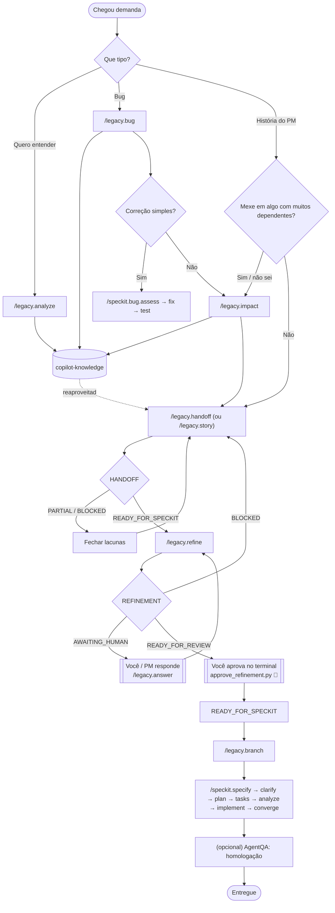

# Manual completo — Legacy Discovery + Spec Kit v6

> **Do pedido do PM ao código, sem adivinhar e sem regressão.**
> Este manual cobre o pacote inteiro — cada skill, cada comando, cada artefato, cada script e cada mensagem — e acompanha exemplos reais do começo ao fim.

Versão do pacote: **bundle 1.4.1 · Legacy Discovery V2.4 · Spec Kit 1.0.1 · GitHub Copilot** · [baixar a última versão](https://github.com/rafaeldevwp/legacy-discovery-speckit/releases/latest)

| Se você quer... | Vá para |
|---|---|
| entender a ideia em 5 minutos | [Parte I](#parte-i--entender) |
| instalar | [capítulo 8](#8-instalação-nova) |
| refinar uma história agora | [capítulo 22](#22-exemplo-completo-uma-história-do-pm-do-início-ao-fim) |
| investigar um bug | [capítulo 23](#23-exemplo-completo-um-bug-do-sintoma-à-correção) |
| saber o que um comando faz | [capítulo 21](#21-os-comandos-legacy-um-a-um) |
| entender uma mensagem de erro | [capítulo 34](#34-mensagens-do-validador-e-como-corrigir) |
| consultar rápido | [capítulo 45](#45-cola-rápida) |

## Índice


**Parte I — Entender**

- [1. O que é este pacote, em 1 minuto](#1-o-que-é-este-pacote-em-1-minuto)
- [2. Para quem é e o que cada perfil usa](#2-para-quem-é-e-o-que-cada-perfil-usa)
- [3. As ideias fundamentais](#3-as-ideias-fundamentais)
- [4. Arquitetura do pacote](#4-arquitetura-do-pacote)
- [5. Quem faz o quê](#5-quem-faz-o-quê)
- [6. Mapa dos fluxos](#6-mapa-dos-fluxos)

**Parte II — Instalar e configurar**

- [7. Pré-requisitos](#7-pré-requisitos)
- [8. Instalação nova](#8-instalação-nova)
- [9. Atualizar a partir de uma versão anterior](#9-atualizar-a-partir-de-uma-versão-anterior)
- [10. Opções do instalador, backup e rollback](#10-opções-do-instalador-backup-e-rollback)
- [11. O que muda no seu repositório (e o que versionar)](#11-o-que-muda-no-seu-repositório-e-o-que-versionar)
- [12. Conferir se deu certo (e testar a fechadura)](#12-conferir-se-deu-certo-e-testar-a-fechadura)
- [13. Primeiro uso: constitution e primeiro mapa](#13-primeiro-uso-constitution-e-primeiro-mapa)

**Parte III — As skills em profundidade**

- [14. analyze-legacy-solution — entender o sistema](#14-analyze-legacy-solution--entender-o-sistema)
- [15. investigate-legacy-bug — achar a causa de um bug](#15-investigate-legacy-bug--achar-a-causa-de-um-bug)
- [16. analyze-change-impact — o raio de impacto](#16-analyze-change-impact--o-raio-de-impacto)
- [17. prepare-speckit-context — o handoff AS-IS](#17-prepare-speckit-context--o-handoff-as-is)
- [18. refine-user-story — o PO técnico](#18-refine-user-story--o-po-técnico)
- [19. prepare-feature-branch — a branch segura](#19-prepare-feature-branch--a-branch-segura)
- [20. O Spec Kit, etapa por etapa](#20-o-spec-kit-etapa-por-etapa)

**Parte IV — Comandos**

- [21. Os comandos /legacy.*, um a um](#21-os-comandos-legacy-um-a-um)

**Parte V — Exemplos completos**

- [22. Exemplo completo: uma história do PM do início ao fim](#22-exemplo-completo-uma-história-do-pm-do-início-ao-fim)
- [23. Exemplo completo: um bug, do sintoma à correção](#23-exemplo-completo-um-bug-do-sintoma-à-correção)
- [24. Exemplo completo: o primeiro mapa de um legado](#24-exemplo-completo-o-primeiro-mapa-de-um-legado)
- [25. Outros cenários](#25-outros-cenários)

**Parte VI — Por dentro**

- [26. A base de conhecimento e seus artefatos](#26-a-base-de-conhecimento-e-seus-artefatos)
- [27. O refinamento, seção por seção](#27-o-refinamento-seção-por-seção)
- [28. Ambiguidades: como o PO decide quem responde](#28-ambiguidades-como-o-po-decide-quem-responde)
- [29. Guardrails de regressão e fatias](#29-guardrails-de-regressão-e-fatias)
- [30. Status, ciclos de vida e códigos](#30-status-ciclos-de-vida-e-códigos)
- [31. Governança: fechadura, lacre e fiscal](#31-governança-fechadura-lacre-e-fiscal)
- [32. Os contratos](#32-os-contratos)

**Parte VII — Referência**

- [33. Scripts de terminal](#33-scripts-de-terminal)
- [34. Mensagens do validador e como corrigir](#34-mensagens-do-validador-e-como-corrigir)
- [35. Códigos da criação de branch](#35-códigos-da-criação-de-branch)
- [36. Onde fica cada coisa](#36-onde-fica-cada-coisa)
- [37. Solução de problemas](#37-solução-de-problemas)
- [38. Perguntas frequentes](#38-perguntas-frequentes)
- [39. Glossário](#39-glossário)

**Parte VIII — Time e manutenção**

- [40. Rotina, checklists e boas práticas](#40-rotina-checklists-e-boas-práticas)
- [41. Convivência com o AgentQA](#41-convivência-com-o-agentqa)
- [42. Manutenção do pacote](#42-manutenção-do-pacote)
- [43. Migração e histórico de versões](#43-migração-e-histórico-de-versões)
- [44. Limites conhecidos](#44-limites-conhecidos)
- [45. Cola rápida](#45-cola-rápida)

---

# Parte I — Entender

## 1. O que é este pacote, em 1 minuto

Você trabalha num sistema legado. O PM manda uma história. Se a IA for direto para o código, ela **supõe** o que o sistema faz hoje e **supõe** o que o PM quis dizer. É daí que vem a regressão.

Este pacote coloca três etapas antes do código, e uma fechadura em volta delas:

```text
  1. ENTENDER O HOJE          2. ESCLARECER O PEDIDO          3. ESPECIFICAR E FAZER
  (Legacy Discovery)          (PO técnico)                    (Spec Kit)

  "Como o sistema faz         "O que exatamente o PM          "Como vamos mudar,
   isso hoje?"                 quer? O que não pode            em que ordem?"
                               quebrar?"
        │                            │                               │
        ▼                            ▼                               ▼
     HANDOFF          ─────►     REFINEMENT         ─────►     spec → plan → tasks → código
                              (aprovado por você)

  🔒 fechadura: o agente não aprova, não escreve código de produção, não afrouxa as regras, não publica
```

Tudo por **comandos**, como o Spec Kit:

```text
/legacy.story <história do PM>  →  você responde  →  você aprova no terminal  →  /speckit.specify
```

O pacote é composto por:

| Peça | O que é | Quantidade |
|---|---|---|
| **Skills** | instruções especializadas que o Copilot segue | 6 ativas |
| **Comandos** | atalhos `/legacy.*` no chat do Copilot | 13 |
| **Agente + hook** | o agente `legacy-discovery` e a fechadura que confere cada ação dele | 1 + 1 |
| **Contratos** | regras escritas: nomes, status, donos, handoffs, falhas | 5 documentos |
| **Scripts** | Python puro que valida, indexa, gera IDs, mostra status, aprova, arquiva | 7 |
| **Spec Kit oficial** | o framework de especificação do GitHub, versão fixada | 1.0.1 |
| **Suíte de testes** | prova de não-regressão do próprio pacote | 108 testes |

## 2. Para quem é e o que cada perfil usa

| Perfil | Usa principalmente | Momento-chave |
|---|---|---|
| **Desenvolvedor** | `/legacy.analyze`, `/legacy.bug`, `/legacy.impact`, `/legacy.branch`, Spec Kit | antes de mexer em área desconhecida |
| **Tech lead / arquiteto** | `/legacy.analyze` (mapa, ADRs), `/legacy.impact`, `/speckit.plan` | revisão de raio de impacto e de arquitetura |
| **PO / analista** | `/legacy.story`, `/legacy.answer`, aprovação | refinamento da história |
| **PM** | responde às perguntas do PO (não precisa usar a ferramenta) | decisões de negócio |
| **QA** | guardrails de regressão do refinamento, testes de caracterização, AgentQA depois | definição de "não pode quebrar" |
| **Mantenedor do pacote** | `tests/`, `tools/build_release.py`, CI | ao evoluir o pacote ([cap. 42](#42-manutenção-do-pacote)) |

> O PM **não precisa** abrir o VS Code. O PO técnico gera perguntas fechadas, com opções e consequências, que podem ser coladas num e-mail ou num comentário do board.

## 3. As ideias fundamentais

### Ideia 1 — AS-IS × TO-BE

| | Significa | Quem cuida |
|---|---|---|
| **AS-IS** | como o sistema funciona **hoje** | skills de Discovery |
| **TO-BE** | como o sistema vai funcionar **depois** da mudança | Spec Kit |

As skills deste pacote **nunca** decidem o TO-BE. Elas levantam fatos e esclarecem o pedido.

### Ideia 2 — Conhecimento primeiro, código depois

Antes de abrir qualquer arquivo de código, as skills leem o que já foi descoberto (`.github/copilot-knowledge/INDEX.md`). O código só é aberto para fechar **uma lacuna específica**, dentro de um **orçamento** (número máximo de arquivos e rodadas).

### Ideia 3 — Suficiência, não existência

Existir um `INDEX.md` não prova nada. A pergunta é: *o que está salvo é **suficiente** para este pedido?* Cada dimensão (estrutura, comportamento, regras, dependências, impacto, fronteiras, testes) é classificada como `COVERED`, `PARTIAL`, `UNKNOWN`, `STALE` ou `NOT_APPLICABLE` ([cap. 17](#17-prepare-speckit-context--o-handoff-as-is)).

### Ideia 4 — Fato, inferência e desconhecido

Tudo que as skills afirmam é rotulado:

| Rótulo | Significa | Exige |
|---|---|---|
| `FACT` | lido diretamente no código ou no conhecimento | evidência citável (`arquivo:linha`, ID de artefato) |
| `INFERRED` | dedução razoável | evidência + selo de confiança |
| `UNKNOWN` | ninguém sabe ainda | ser listado, não escondido |

### Ideia 5 — Confiança tem critério objetivo

"Alta/Média/Baixa" não é impressão do modelo. Para padrões de arquitetura, mede **repetição** no código (3+ ocorrências consistentes = Alta). Para hipóteses de bug, mede **quanto a evidência explica o sintoma** (caminho traçável até a linha = Alta). Detalhes nos capítulos [14](#14-analyze-legacy-solution--entender-o-sistema) e [15](#15-investigate-legacy-bug--achar-a-causa-de-um-bug).

### Ideia 6 — Artefato, status e dono

Cada resultado vira um **artefato**: um arquivo Markdown com cabeçalho (frontmatter). Todo artefato tem:

- um **tipo** (`SPECKIT_HANDOFF`, `STORY_REFINEMENT`...);
- um **status** em inglês maiúsculo (`READY_FOR_SPECKIT`, `AWAITING_HUMAN`...), que libera ou trava a próxima etapa;
- um **único dono**: só uma skill pode escrevê-lo. As outras leem e pedem mudanças via `knowledge_updates`.

### Ideia 7 — O código diz como é; só o humano diz como deve ser

Regra do PO técnico. Dúvida sobre o presente → conhecimento e código. Dúvida sobre intenção, regra nova ou escopo → **pergunta para você**, e nada avança sem resposta.

### Ideia 8 — Aprovação é ato humano, e fica selada

O PO grava no máximo `READY_FOR_REVIEW`. Só você, rodando `approve_refinement.py` no seu terminal, leva o refinamento a `READY_FOR_SPECKIT`. A aprovação grava um lacre (`approval_digest`): se alguém mexer depois, ela cai.

### Ideia 9 — Regra verificada por mecanismo, não por promessa

| Camada | Garante |
|---|---|
| **Instrução** (SKILL.md, comando) | o agente sabe o que fazer |
| **Validador** (`validate_artifacts.py`) | o artefato está completo, rastreável e com evidência real |
| **Fechadura** (hook) | o agente não consegue fazer o que é proibido |
| **Testes + CI** | o próprio pacote não regride |

### Ideia 10 — Local-only

Tudo o que as skills geram (`.github/copilot-knowledge/`) fica **só na sua máquina**: não vai para o Git. O que vai para o Git é o que o Spec Kit gera (`specs/`) e o código.

## 4. Arquitetura do pacote

```text
┌──────────────────────────── VS Code + GitHub Copilot (Agent Mode) ────────────────────────────┐
│                                                                                               │
│   Você digita /legacy.story …                                                                 │
│          │                                                                                    │
│          ▼                                                                                    │
│   .github/prompts/legacy.*.prompt.md  ──(agent: legacy-discovery)──►  .github/agents/          │
│                                                                        legacy-discovery.agent.md│
│                                                                                │              │
│                               antes de CADA ferramenta ─────────────────────────┤              │
│                                                                                ▼              │
│                                                         .github/hooks/legacy_governance.py    │
│                                                               allow / deny  🔒                 │
│          │                                                                                    │
│          ▼  segue                                                                             │
│   .github/skills/<skill>/SKILL.md  +  references/                                             │
│          │                                                                                    │
│          ▼  grava                                     ▼  valida / indexa / IDs / status       │
│   .github/copilot-knowledge/  (LOCAL-ONLY)   ◄──  .github/skill-contracts/scripts/*.py        │
│     INDEX.md, handoffs/, refinements/, ...          (regras em .github/skill-contracts/*.md)  │
│          │                                                                                    │
│          ▼  lido por                                                                          │
│   Spec Kit: /speckit.specify → … → /speckit.converge  →  specs/  (versionado)                 │
└───────────────────────────────────────────────────────────────────────────────────────────────┘

   Você, no seu terminal:  approve_refinement.py  (a única porta para READY_FOR_SPECKIT) 🔏
```

## 5. Quem faz o quê

| Quem | Faz | Nunca faz |
|---|---|---|
| **Você / o PM** | decide regra de negócio e escopo, responde perguntas, **aprova** o refinamento | — |
| `analyze-legacy-solution` | mapeia projetos, dependências, integrações, decisões existentes; aprofunda classes sob pedido | planejar modernização, TO-BE |
| `investigate-legacy-bug` | localiza a causa provável de um bug, com evidência; gera teste de regressão sob pedido | corrigir código de produção |
| `analyze-change-impact` | mostra quem depende do que vai mudar, com risco objetivo | dizer se a mudança é boa ou como fazê-la |
| `prepare-speckit-context` | gera o **HANDOFF**: o AS-IS suficiente da mudança | propor solução |
| `refine-user-story` | PO técnico: gera o **REFINEMENT** (AC, guardrails, fatias, perguntas) | decidir negócio ou arquitetura; aprovar |
| `prepare-feature-branch` | cria `feature/mmYYYY/...` a partir da `main` atualizada | stash, reset, merge, rebase, force, push |
| **Fechadura** (hook) | confere cada ação do agente antes de acontecer | deixar o agente aprovar, escrever código, afrouxar regras ou publicar |
| **Validador** | confere formato, rastreabilidade, evidência e lacre | corrigir sozinho |
| **Spec Kit** | spec, plan, tasks, implementação, convergência | — |

## 6. Mapa dos fluxos



Os três caminhos:

1. **Quero entender** → `/legacy.analyze` e para. O conhecimento fica salvo e barateia tudo o que vier depois.
2. **Bug** → `/legacy.bug`. Correção pontual vai para a extensão de bug do Spec Kit; correção que muda regra segue o caminho da mudança.
3. **História do PM** → `/legacy.story` → você responde → você aprova → `/legacy.branch` → Spec Kit.

# Parte II — Instalar e configurar

## 7. Pré-requisitos

| Item | Versão | Como conferir | Observação |
|---|---|---|---|
| Git | qualquer recente | `git --version` | o repositório precisa ter `.git` na raiz |
| Python | **3.11 ou superior** | `python --version` | testado em 3.11 e 3.13 (Windows e Linux) |
| VS Code + GitHub Copilot | Copilot Chat com **Agent Mode** | seletor "Agent" no chat | prompt files e agentes customizados habilitados |
| Internet | só na primeira instalação | — | baixa o `specify-cli` oficial |
| `uv` | opcional | `uv --version` | sem ele, o instalador usa `pip` |

> ⚠️ **Windows — caminho curto.** Descompacte em `C:\Ferramentas\`. Caminhos com mais de 260 caracteres fazem o Python ignorar arquivos **em silêncio**.
>
> ⚠️ **Python no PATH do VS Code.** A fechadura roda `python .github/hooks/legacy_governance.py`. Confira `python --version` **no terminal integrado do VS Code**, não só no seu terminal.

## 8. Instalação nova

**Passo 1 — Proteja seu código.** Na raiz do repositório legado:

```bash
git status
```

Se houver alteração pendente, faça commit ou stash antes. O instalador faz backup, mas é melhor ter tudo commitado.

**Passo 2 — Baixe e descompacte** o `legacy-discovery-speckit-v1.4.1.zip` da página de [Releases](https://github.com/rafaeldevwp/legacy-discovery-speckit/releases/latest) em `C:\Ferramentas\`.

Opcional — confira a integridade do pacote antes de instalar:

```bash
cd C:\Ferramentas\legacy-discovery-speckit-v1.4.1
python tools/build_release.py --check
```

```text
release check passed
```

**Passo 3 — Execute** `INSTALAR-WINDOWS.bat` (dois cliques) e informe a raiz do repositório:

```text
Repositorio: C:\Projetos\ConsultaVeiculos
```

O instalador faz, nesta ordem:

```text
1. backup preventivo de tudo o que ele vai tocar
2. instala o specify-cli 1.0.1 oficial (uv ou pip)
3. roda: specify init --here --force --non-interactive --integration copilot --ignore-agent-tools
4. instala as 6 skills e os contratos
5. arquiva skills antigas da V1 (sem apagar)
6. instala os 13 comandos /legacy.*
7. instala a fechadura (agente + hook)
8. cria .github/copilot-knowledge/ e configura .git/info/exclude (local-only)
9. grava .github/legacy-discovery/installation.json
10. valida que tudo foi instalado
```

A saída termina assim:

```text
Comandos instalados: 13 (/legacy.*) em .github/prompts/
Fechadura instalada: agente legacy-discovery + hook .github/hooks/legacy_governance.py
...
INSTALAÇÃO CONCLUÍDA.

Comandos das skills: digite /legacy.help no chat do Copilot.
Primeiro uso recomendado:
  1) /speckit.constitution
  2) Peça: 'Use analyze-legacy-solution para iniciar o mapa deste legado.'
  3) Para uma US do PM: /legacy.story <história literal>
     Responda com /legacy.answer; /legacy.approve mostra o comando de aprovação que só você roda
  4) Acompanhe com /legacy.status
  5) Com o REFINEMENT em READY_FOR_SPECKIT: /legacy.branch <descrição>
  6) Depois execute /speckit.specify
```

**Alternativas ao `.bat`:**

```powershell
# PowerShell
.\install.ps1 -TargetPath "C:\Projetos\ConsultaVeiculos"
```

```bash
# Python direto (qualquer SO)
python install.py --target "C:\Projetos\ConsultaVeiculos"

# Linux/macOS
./install.sh /caminho/do/repositorio
```

## 9. Atualizar a partir de uma versão anterior

Se o repositório já tem o Spec Kit (v4 ou v5 instaladas), **não reinstale o Spec Kit**:

```bash
python C:\Ferramentas\legacy-discovery-speckit-v1.4.1\install.py --target "C:\Projetos\ConsultaVeiculos" --skip-speckit-install --skip-speckit-init
```

| Item | O que acontece |
|---|---|
| `.github/copilot-knowledge/` (seu conhecimento) | **preservado**; só cria pastas que faltarem |
| As 5 skills da v4 | reinstaladas **idênticas** (byte a byte) |
| `refine-user-story` | instalada/atualizada |
| `.github/skill-contracts/` | substituída pela versão nova (o backup guarda a anterior) |
| `.github/prompts/legacy.*.prompt.md` | instalados/atualizados; **outros prompts intocados** |
| `.github/hooks/legacy_governance.py`, `.github/agents/legacy-discovery.agent.md` | instalados; **hooks e agentes de outros pacotes (ex.: AgentQA) intocados** |
| `.git/info/exclude` | bloco local-only mantido, sem duplicar |
| Refinamentos aprovados na v5 | continuam válidos; o validador mostra `WARNING` sugerindo reaprovar para selar |
| Handoffs antigos com citação quebrada | só `WARNING` |

Depois de atualizar, rode:

```bash
python .github/skill-contracts/scripts/validate_artifacts.py --root .github/copilot-knowledge
```

## 10. Opções do instalador, backup e rollback

| Opção (`install.py`) | Opção (`install.ps1`) | Efeito |
|---|---|---|
| `--target <repo>` | `-TargetPath <repo>` | raiz do repositório (precisa ter `.git`) |
| `--skip-speckit-install` | `-SkipSpecKitInstall` | não instala o `specify-cli` |
| `--skip-speckit-init` | `-SkipSpecKitInit` | não roda `specify init` |
| `--keep-legacy-v1` | `-KeepLegacyV1` | mantém ativas as skills V1 (`coordinate-fix`, `execute-fix-plan`, `run-solution-regression`) |
| `--spec-kit-version X` | — | outra versão do Spec Kit (padrão `1.0.1`) |

**Backup.** Antes de tocar em qualquer coisa, o instalador copia para `<pasta do pacote>\backups\<repo>-AAAAmmdd-HHMMSS\`:

```text
.specify/  .github/prompts/  .github/skill-contracts/
.github/skills/<cada skill do pacote e da V1>
.github/hooks/legacy_governance.py  .github/agents/legacy-discovery.agent.md
```

**Rollback** (voltar ao estado anterior):

1. Se tudo estava commitado antes (recomendado): `git status` mostra o que o instalador mudou; reverta o que quiser com as ferramentas normais do Git.
2. Sem commit: copie de volta as pastas do backup para o repositório.
3. Para remover só a fechadura: apague `.github/hooks/legacy_governance.py` e `.github/agents/legacy-discovery.agent.md` e troque `agent: legacy-discovery` por `agent: agent` nos prompts `legacy.*` (o pacote volta ao comportamento da v5).

> A pasta `backups/` fica **fora** do seu repositório. Não a publique: ela pode conter configuração do seu projeto. O `tools/build_release.py` recusa gerar pacote com `backups/` dentro.

## 11. O que muda no seu repositório (e o que versionar)

```text
SEU-REPO/
├── .github/
│   ├── agents/
│   │   └── legacy-discovery.agent.md    ← agente dos comandos, com a fechadura      [versionar]
│   ├── hooks/
│   │   └── legacy_governance.py         ← a fechadura (hook PreToolUse)             [versionar]
│   ├── prompts/
│   │   ├── legacy.*.prompt.md           ← 13 comandos                               [versionar]
│   │   └── ...                          ← seus prompts e os do Spec Kit, intocados
│   ├── skills/
│   │   ├── analyze-legacy-solution/                                                  [versionar]
│   │   ├── investigate-legacy-bug/
│   │   ├── analyze-change-impact/
│   │   ├── prepare-speckit-context/
│   │   ├── prepare-feature-branch/
│   │   └── refine-user-story/
│   ├── skill-contracts/                 ← regras + scripts                          [versionar]
│   ├── legacy-workflow-v1/              ← skills V1 arquivadas, se existiam          [versionar]
│   ├── legacy-discovery/                ← docs do pacote                            [versionar]
│   │   └── installation.json            ←                                           [LOCAL-ONLY]
│   └── copilot-knowledge/               ←                                           [LOCAL-ONLY]
│       ├── INDEX.md
│       ├── SOLUTION-OVERVIEW.md
│       ├── projects/  decisions/  deep-dives/
│       ├── investigations/  impact-analyses/
│       ├── handoffs/  refinements/
│       ├── governance-log/              ← o que a fechadura negou
│       └── proposals/  fix-plans/       ← histórico V1 (compatibilidade)
├── .specify/                            ← Spec Kit                                  [política do time]
└── specs/                               ← features do Spec Kit                      [política do time]
```

**Regra de ouro do versionamento:** o **ferramental** (skills, contratos, comandos, agente, hook) vai para o Git para o time todo usar o mesmo. O **conhecimento gerado** (`copilot-knowledge/`) e o `installation.json` ficam locais. O instalador adiciona ao `.git/info/exclude`:

```text
# legacy-discovery-speckit-v4 local-only artifacts (managed)
.github/copilot-knowledge/
.github/legacy-discovery/installation.json
# end legacy-discovery-speckit-v4 local-only artifacts
```

> O nome `v4` no marcador é proposital: mudá-lo faria reinstalações duplicarem o bloco.

Revise sempre depois de instalar:

```bash
git status
git diff
```

## 12. Conferir se deu certo (e testar a fechadura)

**12.1 — No terminal**, na raiz do repositório:

```bash
python .github/skill-contracts/scripts/validate_artifacts.py --root .github/copilot-knowledge
python .github/skill-contracts/scripts/story_status.py
```

```text
validation passed: 0 artifact(s)
# Status das histórias

Nenhuma história em andamento. Comece com `/legacy.story <história do PM>`.
```

**12.2 — A fechadura responde?** Simule uma ação proibida direto no hook (PowerShell ou Git Bash):

```bash
echo '{"toolName":"run_in_terminal","toolInput":{"command":"git push"}}' | python .github/hooks/legacy_governance.py
```

Esperado: um JSON com `"permissionDecision": "deny"` e código de saída `2`. Uma ação permitida devolve `"allow"` e código `0`.

**12.3 — No VS Code**, Copilot Chat em **Agent Mode**, digite `/legacy.` — devem aparecer os 13 comandos. Rode:

```text
/legacy.help
```

**12.4 — Teste de ponta a ponta da fechadura** (opcional, recomendado na primeira vez). No chat:

```text
/legacy.analyze Crie um arquivo src/teste-fechadura.txt com o texto "oi".
```

Esperado: o agente tenta, a fechadura nega (`Escrita bloqueada em src/teste-fechadura.txt: as skills só escrevem em .github/copilot-knowledge/ e em projetos de teste`), e o agente explica a negação sem tentar contornar. A negação aparece em `.github/copilot-knowledge/governance-log/`.

**12.5 — Provar a não-regressão do pacote** (na pasta do pacote, não no repo):

```bash
cd C:\Ferramentas\legacy-discovery-speckit-v1.4.1
python -m unittest discover -s tests -v
python tools/build_release.py --check
```

```text
Ran 108 tests in 20.1s
OK
release check passed
```

## 13. Primeiro uso: constitution e primeiro mapa

Faça **uma vez** por repositório.

**13.1 — Regras do projeto (constitution do Spec Kit).** A constitution guia todo `/speckit.plan` e `/speckit.implement`. Em legado, ela deve **preservar o AS-IS real**, não inventar princípios. Exemplo:

```text
/speckit.constitution
Este é um sistema legado crítico em .NET Framework 4.7.2 com serviços WCF.
Preserve contratos públicos (WCF, ASMX, arquivos de integração) e compatibilidade existentes.
Respeite a arquitetura atual (Modelo / Dados / Negócio) salvo decisão explícita no plan.
Reutilize os frameworks e padrões de teste já presentes (MSTest + Moq).
Não adicione dependência sem justificativa registrada.
Trate HANDOFFs como contexto factual AS-IS e REFINEMENTs aprovados como requisitos confirmados pelo PO/PM.
Decisões TO-BE pertencem ao Spec Kit. Não trate inferência como fato.
Toda mudança começa pelos testes de caracterização dos guardrails sem cobertura.
Consumidores externos e integrações fora do repositório são risco explícito.
Regressão proporcional ao raio de impacto.
```

> Não copie esse texto às cegas: troque tecnologia, arquitetura e frameworks pelos do **seu** sistema. Princípio inventado para preencher template atrapalha mais do que ajuda.

**13.2 — Primeiro mapa do legado:**

```text
/legacy.analyze Estrutura geral: projetos, responsabilidades, dependências e integrações externas.
Profundidade estrutural. Não aprofunde classes ainda.
```

A skill pergunta escopo, profundidade e limites antes de começar. Responda curto. Ao final você terá `SOLUTION-OVERVIEW.md` e `projects/PROJECT-*.md` — e os próximos pedidos reaproveitam isso em vez de reler o código. Exemplo completo no [capítulo 24](#24-exemplo-completo-o-primeiro-mapa-de-um-legado).

> Não peça para "estudar o repositório inteiro a fundo". O pacote trabalha por **descoberta progressiva**: estrutura de tudo (barato), profundidade só onde a história precisa.

# Parte III — As skills em profundidade

Cada skill tem um `SKILL.md` (as regras) e uma pasta `references/` (os detalhes), em `.github/skills/<skill>/`. Este capítulo resume o que cada uma faz, **como decide** e **o que entrega**. Todas seguem três regras comuns:

1. **Checkpoint humano no início:** confirmam escopo e ambiguidades antes de gastar leitura cara.
2. **Conhecimento primeiro:** leem `INDEX.md` e os artefatos relacionados antes de abrir código.
3. **Validar → indexar → validar** depois de gravar qualquer artefato.

## 14. `analyze-legacy-solution` — entender o sistema

**Comando:** `/legacy.analyze <área ou pergunta>` · **Dono de:** `SOLUTION_OVERVIEW`, `PROJECT`, `ADR`, `DEEP_DIVE`

### 14.1 Quando usar

- primeira vez num repositório ("faz o mapa");
- vai mexer numa área que ninguém documentou;
- quer entender uma regra específica em detalhe (deep-dive);
- quer atualizar o conhecimento de um projeto que mudou (refresh).

Não use para: planejar modernização, desenhar TO-BE, gerar spec/plan/tasks.

### 14.2 Checkpoint inicial

A skill confirma, em linguagem objetiva:

1. escopo funcional priorizado (qual área/projeto);
2. profundidade: **estrutural** (barata) ou **completa**;
3. restrições de tempo/custo de exploração.

### 14.3 Regra de entrada: índice primeiro, cobertura depois

```text
existe INDEX.md?
   ├─ sim → lê SÓ o índice → abre só os artefatos relacionados → é suficiente para ESTE pedido?
   │           ├─ sim e atual → responde com o que está salvo (NÃO abre código para "reconfirmar")
   │           └─ ausente / parcial / stale → discovery incremental SÓ na área necessária
   └─ não → discovery (fases abaixo)
```

### 14.4 As fases do discovery (custo crescente)

| Fase | O que faz | Custo |
|---|---|---|
| **0 — Formato** | detecta, por projeto, `.csproj` **SDK-style** (moderno) ou **clássico** (.NET Framework: `ToolsVersion`, `<Compile Include>`, `packages.config`); solution clássica, moderna ou híbrida | baixo |
| **0.5 — Escopo** | solution com mais de ~15 projetos, ou pedido focado: estrutura de **todos**, profundidade só no pedido (`depth: COMPLETE` nele, `STRUCTURAL` nos demais) | — |
| **1 — Estrutura** | lista `.sln`, `.csproj`, árvore de pastas (2-3 níveis), classifica projetos (`*.Domain`, `*.Api`… e também **Modelo / Dados (DAL) / Negócio (BLL)**) | baixo |
| **2 — Dependências de compilação** | `ProjectReference`, `PackageReference` ou `packages.config`; DLL solta sem NuGet vira ponto de atenção | baixo |
| **2.5 — Chamadas de serviço** | segundo grafo: WCF (`<system.serviceModel><client>`), `Service References`, ASMX, `HttpClient`/`WebClient` — **o acoplamento escondido que o build não mostra**; destino fora da solution = "externo" | baixo |
| **3 — Arquivos-âncora** | só nos projetos em escopo: `Program.cs`/`Startup.cs` ou `Global.asax.cs`, `Web.config` (sem copiar segredos), `App_Start/`, `*.svc` (só `[OperationContract]`), controllers (só assinaturas), `DbContext`/`.edmx` (só existência) | médio |
| **4 — Busca dirigida** | `TODO`, `FIXME`, `HACK`, `Obsolete`, autenticação (`[Authorize]`, Forms Auth, JWT), sinais de stack legada (`System.Web`, `HttpContext.Current`, EF6, VB.NET) | médio |

Limites da fase 3: não lê arquivo de mais de ~500 linhas inteiro, não relê arquivo já visto, não abre testes (salvo projeto de teste), amostra projetos análogos, não decodifica arquivo com encoding legado quebrado (registra e segue).

### 14.5 Front-end legado

Se o projeto é de UI (`*.Web`, `.aspx`, `Scripts/`), a skill detecta **AngularJS 1.x**, **Web Forms (ASPX)**, **ASMX/PageMethods** e o padrão **híbrido** (`ng-app` dentro de `.aspx`/`.master`). O valor principal é o mapa **front → back**: qual `$http.get(...)` chama qual controller/`.asmx`. Não abre cada controller AngularJS nem views parciais.

### 14.6 Confiança (padrões de arquitetura)

| Nível | Critério |
|---|---|
| **Alta** | padrão consistente em 3+ lugares, sem contradição |
| **Média** | 1-2 ocorrências, ou parte segue e parte não |
| **Baixa** | um único indício indireto |

Mede "o quão sustentado está no código", **nunca** "o quão certo estou do motivo". Motivo/intenção vai para "Perguntas em aberto". Fatos diretos (lista de `DbSet`, `ProjectReference`, pacotes) não levam selo.

### 14.7 O que entrega

| Artefato | Conteúdo | Local |
|---|---|---|
| `SOLUTION-OVERVIEW.md` | frameworks (híbrida?), contexto em 1-2 frases, **dois grafos** (compilação e chamadas de serviço), padrão arquitetural com confiança, tabela de projetos, ADRs, 3-6 riscos | raiz da base |
| `PROJECT-{slug}.md` | camada/responsabilidade (com confiança), core funcional, estrutura relevante, front-end, dependências (internas, pacotes, chamadas feitas e recebidas), dívida técnica, perguntas em aberto; `depth: STRUCTURAL` ou `COMPLETE` | `projects/` |
| `ADR-NNNN-{slug}.md` | decisão **observada** no código (não histórica): contexto, decisão, evidências, consequências, perguntas; status `INFERRED` | `decisions/` |
| `DEEP-DIVE-{projeto}-{classe}.md` | só sob pedido: uma seção por método, fluxo passo a passo, fluxograma Mermaid, sequência entre camadas, fato × interpretação | `deep-dives/` |

Merece ADR: escolha de acesso a dados, estilo de comunicação (WCF × REST × fila), autenticação, padrão de camadas, framework mantido de propósito, **acoplamento via serviço em vez de referência** (sem presumir o motivo). Não merece: detalhe pequeno.

### 14.8 Deep-dive — aprofundar uma regra

```text
/legacy.analyze Aprofunde o método CalcularDesconto da classe CalculadoraDesconto no projeto Negocio.
```

Regras que você vai notar:

- escopo vago ("aprofunde o Negócio inteiro") → a skill **lista candidatos** e pede para você escolher;
- **um arquivo por classe**, uma seção por método; o segundo método da mesma classe vira **nova seção** no mesmo arquivo;
- cada frase do fluxo corresponde a uma condição real do código ("se `cliente.TipoConta == Premium`..."), nunca a frase genérica;
- chamadas para fora do escopo são **listadas, não abertas**;
- não encadeia aprofundamentos por conta própria.

### 14.9 Refresh e staleness

A data de modificação do `.csproj` (`source_modified_at`) é **sinal estrutural**, não prova de que as regras continuam iguais. A skill só reprocessa com sinal concreto (seu pedido, diff conhecido, inconsistência com investigação recente), e só a área afetada.

```text
/legacy.analyze Refresh do projeto Consulta: o PbhClient mudou na última sprint.
```

### 14.10 Exemplos de pedido

```text
/legacy.analyze Mapa estrutural da solution inteira.
/legacy.analyze Analise só o projeto Faturamento, profundidade completa.
/legacy.analyze Quem chama o serviço WCF ConsultaService?
/legacy.analyze Aprofunde a regra de cálculo de multa em MultaService.Calcular.
```

## 15. `investigate-legacy-bug` — achar a causa de um bug

**Comando:** `/legacy.bug <sintoma>` · **Dono de:** `INVESTIGATION` (e do teste de regressão, se gerado)

### 15.1 O que faz e o que não faz

Sai de "temos um problema no cálculo X" para "provavelmente é aqui, e é por isso", com evidência e confiança. **Nunca corrige** código de produção. Pode, **sob pedido**, gerar um teste que prova o bug.

### 15.2 Checkpoint inicial (fase 0)

| Pergunta | Por quê |
|---|---|
| O que é esperado? | define o assert |
| O que acontece de fato? | define o sintoma |
| **Tem um exemplo concreto?** | sem ele a investigação vira busca cega — a skill **pergunta antes de seguir** |
| Desde quando? | regressão recente × sempre foi assim |
| Termos de negócio usados | viram as palavras-chave da busca |
| Ambiente, janela, impacto, urgência | contexto de prioridade |

### 15.3 Triagem (pare quando tiver 1-2 hipóteses Alta)

| Fase | O que faz |
|---|---|
| **1 — Base de conhecimento** | procura os termos no INDEX, projetos e deep-dives; se há deep-dive do método, compara cada ramo do fluxograma com o sintoma — pode resolver sem abrir código |
| **2 — Busca dirigida** | procura os termos no código (métodos, campos, mensagens de erro); lista candidatos sem abrir |
| **3 — Aprofundamento seletivo** | lê o corpo de **no máximo 1-3** candidatos; acha o ramo que bate com o sintoma; descarta explicitamente o que não pode ser a causa |
| **4 — Fronteiras** | se o dado atravessa serviços, usa o grafo de chamadas; destino fora do repo = limite explícito |
| **5 — Relatório** | hipóteses, evidência, descartes, próximo passo para confirmar |

### 15.4 Confiança (hipóteses de bug)

| Nível | Critério |
|---|---|
| **Alta** | caminho de código traçável que, com o exemplo concreto, produz **exatamente** o erro — aponta a linha/condição |
| **Média** | o candidato está no fluxo, mas não foi possível confirmar que é aquele caminho |
| **Baixa** | indício indireto, só por completude |

Nunca "Alta" sem caminho traçável. E Alta **não** é "pode corrigir": leitura estática não substitui reprodução.

### 15.5 O relatório (`INVESTIGATION`)

Status: `STATIC_HYPOTHESIS` (só leitura) → `CONFIRMED` (teste reproduziu) / `REFUTED` / `BLOCKED`. Seções: contexto, hipóteses (confiança, local, evidência, como confirmar), descartadas, fronteiras de serviço, evidência de execução, `knowledge_updates` pedidos, limitações e próximo passo.

`CONFIRMED` exige `confirmed_test` preenchido — o validador cobra.

### 15.6 Teste de regressão (módulo opcional)

Só quando você pede ("monta um teste para essa hipótese"). Pré-requisitos: hipótese Média ou Alta e o cenário concreto.

| Regra | Detalhe |
|---|---|
| **Dados sensíveis** | nunca CPF, CNPJ, nome, e-mail, telefone reais; gera sintético que preserva a propriedade relevante (ex.: CPF sintético válido) e comenta isso no teste |
| **Framework** | usa o que a solution já tem (MSTest, xUnit, NUnit); não introduz outro; sem projeto de teste → pergunta antes de criar |
| **Mock** | prioridade: o do mesmo arquivo → o do mesmo projeto de teste → o referenciado no `.csproj`/`packages.config`; nunca mistura dois; nenhum → pergunta |
| **Arquivo** | se já existe `{Classe}Tests.cs`, adiciona método nele |
| **Assert** | o resultado **esperado pelo PO**, não o atual — o teste **nasce vermelho** |
| **Nome** | `Metodo_Cenario_ResultadoEsperado` |
| **Execução** | só o menor escopo; não instala SDK/runner sem autorização; evidência sanitizada |

Resultado da execução:

| O teste... | Conclusão |
|---|---|
| falha no assert esperado | ofensor **confirmado** (`CONFIRMED`) |
| passa antes da correção | hipótese **refutada** — não significa que o bug não existe |
| não compila / ambiente falha | **inconclusivo** — nunca confirma |

> A fechadura permite ao agente escrever **só em projetos de teste** (`tests/`, `*.Tests/`, `*Tests.cs`) — justamente para este módulo.

### 15.7 Construção orgânica do conhecimento

A primeira investigação numa área nova custa caro — alguém precisa ler código nunca lido. Mas nada se perde: o relatório e os `knowledge_updates` alimentam a base. O segundo bug na mesma área nasce mais barato.

### 15.8 Exemplo de pedido

```text
/legacy.bug
Sintoma: segunda via do boleto sai com vencimento no domingo.
Esperado: próximo dia útil.
Exemplo: boleto sintético do contrato de teste 000123, vencimento original 13/09/2026 (domingo).
Ambiente: produção, desde 01/09. Urgência alta, afeta cobrança.
```

Exemplo completo no [capítulo 23](#23-exemplo-completo-um-bug-do-sintoma-à-correção).

## 16. `analyze-change-impact` — o raio de impacto

**Comando:** `/legacy.impact <alvo>` · **Dono de:** `IMPACT_ANALYSIS`

### 16.1 Checkpoint inicial

1. alvo exato (classe, método, endpoint, contrato);
2. tipo da mudança (comportamento, assinatura, performance, infraestrutura);
3. limite (só este repositório ou também consumidores externos conhecidos).

Alvo amplo demais → a skill propõe um recorte e aguarda.

### 16.2 As fases

| Fase | O que faz |
|---|---|
| **0 — Delimitar** | corpo de método privado ≠ assinatura pública exposta via WS |
| **1 — Base de conhecimento** | quem lista o projeto/classe como dependência; ADRs que mencionam o componente |
| **2 — Código** | grafo de compilação + **uso real** (grep do nome nos projetos que referenciam — referência de projeto não prova uso) |
| **3 — Indiretos** | consumidores via serviço (WCF/ASMX/HTTP); fora do repo = "dependente externo — existe" |
| **4 — Contexto** | ADRs contrariados (risco a mais), deep-dives que ficarão desatualizados, **ausência de teste** (fator de risco), telas que consomem o contrato |

### 16.3 Critério objetivo de risco

| Risco | Quando |
|---|---|
| `HIGH` | contrato externo/público afetado, **ou** 2+ dependentes sem cobertura do cenário |
| `MEDIUM` | existe dependente, ou o alvo não tem cobertura, sem gatilho de HIGH |
| `LOW` | nenhum dos acima |

### 16.4 O que entrega

`IMPACT-{AAAAMMDD}-{slug}.md` com: justificativa do risco, dependentes diretos (`CONFIRMED_USAGE` × `PROJECT_REFERENCE_ONLY`), indiretos/externos (`LOCAL` × `EXTERNAL`), decisões e testes relacionados, documentação afetada, desconhecidos. Status `COMPLETE`, `PARTIAL` ou `BLOCKED`.

**Nunca** diz se a mudança deve ser feita nem como fazê-la com segurança. O próximo passo é `/legacy.handoff`, que consome este impacto.

```text
/legacy.impact HistoricoRepository.Gravar — mudança de comportamento — só este repositório.
```

## 17. `prepare-speckit-context` — o handoff AS-IS

**Comandos:** `/legacy.handoff <mudança>` ou dentro do `/legacy.story` · **Dono de:** `SPECKIT_HANDOFF`

### 17.1 Papel

É a ponte oficial entre o Discovery (AS-IS) e o Spec Kit (TO-BE). Termina quando existe contexto **suficiente, factual e rastreável** para especificar a mudança sem redescobrir o repositório.

### 17.2 Checkpoint inicial

1. objetivo funcional da mudança em uma frase;
2. critério de pronto do handoff;
3. fluxo alvo: `SDD` (spec completa) ou `BUG` (extensão de bug do Spec Kit).

### 17.3 Knowledge preflight

Começa com `SOURCE_ACCESS = DENIED`. Lê só o INDEX, seleciona artefatos relacionados, classifica a cobertura. **Não usa grep nem abre código** enquanto não houver lacuna explícita.

### 17.4 Matriz de cobertura

| Dimensão | Precisa estar claro |
|---|---|
| `STRUCTURE` | projeto(s), responsabilidade, fronteiras |
| `CURRENT_BEHAVIOR` | o fluxo AS-IS relevante |
| `BUSINESS_RULES` | regras observáveis a preservar ou explicitar |
| `DEPENDENCIES` | dependências diretas e de runtime |
| `IMPACT_SURFACE` | consumidores e áreas afetadas |
| `EXTERNAL_BOUNDARIES` | sistemas fora do alcance |
| `TEST_SAFETY_NET` | testes existentes e lacunas |

Cada uma: `COVERED` · `PARTIAL` · `UNKNOWN` · `STALE` · `NOT_APPLICABLE`. Para mudança de comportamento, `CURRENT_BEHAVIOR`, `DEPENDENCIES` e `IMPACT_SURFACE` **não podem** ficar `UNKNOWN` num handoff pronto.

### 17.5 Acesso a código e orçamento

Tudo `COVERED` → não abre código. Há lacuna → `SOURCE_ACCESS = BOUNDED`, só para a lacuna, na ordem: arquivos-âncora já conhecidos → busca dirigida → candidatos mínimos → expansão de chamadas. Orçamento padrão:

| Limite | Valor |
|---|---|
| Rodadas de expansão | 3 |
| Arquivos de código abertos | 12 |
| Buscas após o preflight | 4 |

Esgotou → para e registra o resto em `Unknowns` (`DISCOVERY_BUDGET_EXHAUSTED`). Arquivo gerado/proxy gigante nunca justifica aumentar o orçamento.

### 17.6 Status do handoff

| Status | Significa |
|---|---|
| `READY_FOR_SPECKIT` | AS-IS suficiente, `Blocking: NONE` |
| `PARTIAL` | contexto útil, com lacuna relevante explícita |
| `BLOCKED` | falta evidência indispensável |

"Pronto" não é "sabemos tudo": é "sabemos o suficiente e explicitamos o que não sabemos".

### 17.7 O que o handoff contém

Frontmatter: `request`, `target_flow` (`SDD`/`BUG`), `confidence` (`HIGH`/`MEDIUM`/`LOW`), `source_access` (`NONE`/`BOUNDED`). Seções obrigatórias (o validador cobra): `Request`, `Knowledge Coverage`, `Current Behavior`, `Compatibility Constraints`, `Impact Surface`, `External Boundaries`, `Evidence`, `Unknowns` (com `### Blocking` e `### Non-blocking`), `Explicitly Not Decided`, `Spec Kit Handoff`.

**Proibido no handoff:** arquitetura TO-BE, escolha de biblioteca, tasks, solução apresentada como decidida, escrita em `.specify/`.

### 17.8 Reuso das outras skills

Lacuna estrutural → padrão de `analyze-legacy-solution`; comportamento estranho → `investigate-legacy-bug`; raio de impacto → `analyze-change-impact`. Sem delegação explícita, faz a investigação mínima equivalente e registra `knowledge_updates` para o dono persistir depois.

## 18. `refine-user-story` — o PO técnico

**Comandos:** `/legacy.refine`, `/legacy.story`, `/legacy.answer` · **Dono de:** `STORY_REFINEMENT` (exceto a aprovação, que é humana)

### 18.1 Papel

Você é o dono da intenção de negócio. O PO técnico é o dono da **clareza**. Ele responde, com evidência: o que a história pede (nas palavras do PM), o que ela deixa ambíguo e quem respondeu cada ambiguidade, como fatiar a entrega, e o que não pode regredir.

### 18.2 Checkpoint inicial

1. a história (identificador/título, sem reescrever);
2. quem decide regra de negócio (`decision_owner`);
3. o handoff a usar, se já existir.

### 18.3 Pré-condição: AS-IS antes de refinar

Sem handoff relacionado → só a triagem da história (qualidade + perguntas de intenção), grava `AWAITING_HUMAN` ou `BLOCKED` (`HANDOFF_MISSING`) e recomenda `/legacy.handoff`. **Não faz discovery no lugar do dono do AS-IS.** Handoff `PARTIAL`/`BLOCKED` → o refinamento não pode ficar pronto.

### 18.4 Processo

```text
1. Intake: história LITERAL em "Story (verbatim)" — nunca editada depois
2. Qualidade: INVEST + Definition of Ready → todo GAP vira ambiguidade
3. Base AS-IS: FACT / INFERRED / UNKNOWN com evidência
4. Registro de ambiguidades: escada STORY → KNOWLEDGE → CODE → HUMAN
5. Critérios de aceite (AC-NN), cada um com origem
6. Guardrails de regressão (GR-NN), cada um com prova
7. Plano de execução em fatias (SLICE-NN)
8. O que NÃO foi decidido
9. Status: AWAITING_HUMAN / READY_FOR_REVIEW / BLOCKED
10. Validar → indexar → validar
```

### 18.5 Orçamento de código (menor que o do handoff)

Só para ambiguidade marcada `CODE` que pergunta um **fato AS-IS**: 2 rodadas, 8 arquivos, 3 buscas. Esgotou → vira pergunta ao humano. Código contradiz o handoff → não corrige o handoff; registra `knowledge_updates` e vira pergunta bloqueante (`KNOWLEDGE_STALE`).

### 18.6 Status

| Status | Quem grava | Significa |
|---|---|---|
| `AWAITING_HUMAN` | PO | há pergunta `OPEN_HUMAN` |
| `READY_FOR_REVIEW` | PO | sem pergunta bloqueante; rastreável; aguarda você |
| `READY_FOR_SPECKIT` | **só `approve_refinement.py` (você)** | aprovado e selado |
| `BLOCKED` | PO | pré-condição faltando (`block_reason`) |

Detalhes do artefato nos capítulos [27](#27-o-refinamento-seção-por-seção) a [29](#29-guardrails-de-regressão-e-fatias).

## 19. `prepare-feature-branch` — a branch segura

**Comando:** `/legacy.branch <descrição>` · **Dono de:** a branch `feature/mmYYYY/descricao-curta`

### 19.1 Pré-condições

1. handoff `READY_FOR_SPECKIT` (e, pelo comando `/legacy.branch`, refinamento aprovado se existir);
2. worktree limpo;
3. `origin` existe;
4. `main` local e `origin/main` existem;
5. a branch calculada não existe nem local nem remotamente.

Qualquer falha → **para e reporta**. Nunca "conserta" o repositório sozinha.

### 19.2 O nome da branch

```text
feature/mmYYYY/descricao-curta        ex.: feature/092026/consulta-veiculos-timeout
```

O script normaliza o slug: remove acentos, minúsculas, troca tudo que não é letra/número por `-`, junta hífens repetidos. Mínimo de 3 caracteres. Boas descrições têm 2 a 5 termos significativos; evite IDs e palavras genéricas ("alteracao").

### 19.3 A sequência (determinística, executada uma única vez)

```text
git status --porcelain            → sujo? WORKTREE_DIRTY
git remote get-url origin         → ausente? ORIGIN_MISSING
git fetch origin                  → falhou? FETCH_FAILED
git switch main
git pull --ff-only origin main    → divergiu? MAIN_DIVERGED
main == origin/main ?             → não? MAIN_NOT_SYNCED
branch já existe?                 → sim? BRANCH_EXISTS
git switch -c feature/mmYYYY/slug main
```

Saída de sucesso (JSON):

```json
{"status": "BRANCH_READY", "branch": "feature/092026/consulta-veiculos-timeout",
 "base_branch": "main", "base_commit": "4f2a9c1…", "origin_url": "https://…"}
```

Todos os códigos de bloqueio no [capítulo 35](#35-códigos-da-criação-de-branch).

### 19.4 O que nunca faz

`git stash`, `reset`, `merge`, `rebase`, `clean`, `push --force`, apagar/recriar branch, push. A fechadura reforça: o agente não consegue rodar esses comandos diretamente.

### 19.5 Baseline de build

A branch nasce **antes** do `/speckit.plan`, então ainda não existe comando de build aprovado. A skill não inventa um. Se você ou a constitution fornecerem um comando de baseline seguro, ele roda na `main` atualizada antes de criar a branch; se falhar, a branch não é criada.

## 20. O Spec Kit, etapa por etapa

O Spec Kit oficial (`specify-cli 1.0.1`) é o dono do TO-BE. Os comandos podem aparecer como `/speckit.specify` ou `/speckit-specify` conforme a integração — use o nome do menu `/`.

| Etapa | Para quê | Dica para legado |
|---|---|---|
| `/speckit.constitution` | princípios do projeto (uma vez) | preserve o AS-IS real ([cap. 13](#13-primeiro-uso-constitution-e-primeiro-mapa)) |
| `/speckit.specify` | a spec: o quê e por quê | passe a história **literal** e mande ler o HANDOFF e o REFINEMENT; AC e GR são requisitos |
| `/speckit.clarify` | tira dúvidas da spec | as ambiguidades **não bloqueantes** do refinamento vêm para cá |
| `/speckit.plan` | plano técnico | respeite a arquitetura existente; as "considerações não vinculantes" do refinamento são perguntas para o plan |
| `/speckit.tasks` | decompõe em tarefas | **siga a ordem das fatias**; a primeira tarefa cria os testes de caracterização dos GR sem cobertura |
| `/speckit.analyze` | consistência entre spec, plan e tasks | confira que todo AC e GR tem tarefa |
| `/speckit.implement` | implementa | rode com o seletor do chat em **Agent** (padrão), não em `legacy-discovery` — a fechadura existe para impedir o agente de Discovery de escrever código; a implementação é trabalho do Spec Kit |
| `/speckit.converge` | fecha a entrega | todos os GR provados |

> ⚠️ **Troque o agente antes do Spec Kit.** Os comandos `/legacy.*` rodam no agente `legacy-discovery`. Se o seletor do chat ficar nele, a fechadura vai negar as escritas do `/speckit.implement` (e de qualquer comando que escreva código). Antes do Spec Kit, volte o seletor para **Agent**.

Prompt recomendado para o `specify`:

```text
/speckit.specify <história do PM, literal>

Antes de escrever a spec, leia:
- .github/copilot-knowledge/handoffs/HANDOFF-NNNN-slug.md (AS-IS)
- .github/copilot-knowledge/refinements/REFINEMENT-NNNN-slug.md (AC, respostas humanas, guardrails, fatias)
Trate AC-* e GR-* como requisitos. As considerações técnicas do refinamento não são vinculantes.
Não transforme o handoff em solução técnica.
```

**Extensão de bug** (opcional, para correção pontual):

```bash
specify extension add bug
```

```text
/speckit.bug.assess → /speckit.bug.fix → /speckit.bug.test
```

Use só quando quiser explicitamente esse caminho (`target_flow: BUG`). Correção que exige revisão de requisitos ou arquitetura vai pelo fluxo completo (`SDD`).

# Parte IV — Comandos

## 21. Os comandos `/legacy.*`, um a um

Todos são digitados no **Copilot Chat em Agent Mode**. O texto depois do comando é a entrada.

### Mapa rápido

| Quero... | Comando |
|---|---|
| ver o que existe e o próximo passo | `/legacy.help` |
| levar uma história do PM até o refinamento pronto | `/legacy.story` |
| entender uma parte do sistema | `/legacy.analyze` |
| investigar um bug | `/legacy.bug` |
| saber o que uma mudança afeta | `/legacy.impact` |
| gerar só o AS-IS de uma mudança | `/legacy.handoff` |
| só refinar uma história | `/legacy.refine` |
| responder perguntas do PO | `/legacy.answer` |
| preparar a aprovação (você aprova no terminal) | `/legacy.approve` |
| criar a branch | `/legacy.branch` |
| ver o andamento | `/legacy.status` |
| checar se está tudo válido | `/legacy.validate` |
| limpar artefatos locais | `/legacy.archive` |

### 21.1 `/legacy.help`

**Quando:** sempre que não souber o próximo passo.
**Sintaxe:** `/legacy.help [ID]`

```text
/legacy.help
```

Mostra a tabela de comandos e, para cada história em andamento, o próximo comando. **Não altera nada.**

### 21.2 `/legacy.story` — o fluxo guiado

**Quando:** chegou uma história do PM. É o comando mais usado.
**Sintaxe:** `/legacy.story <história literal>` (+ quem decide negócio)

```text
/legacy.story
US-4821 — Como atendente da central, quero que a consulta de veículos continue mostrando a última
situação conhecida quando o serviço da PBH demorar, para não deixar o cidadão sem resposta.
Critério: não mostrar tela de erro quando der timeout.

Quem decide regra de negócio: Marina (PM).
```

**O que ele faz, em ordem:**

```text
1. /legacy.status  →  já existe algo desta história? retoma de onde parou
2. sem HANDOFF pronto  →  prepare-speckit-context
       PARTIAL/BLOCKED  →  PARA e mostra o que falta
3. HANDOFF pronto  →  refine-user-story
       AWAITING_HUMAN  →  PARA e mostra as perguntas
       BLOCKED         →  PARA e mostra como destravar
       READY_FOR_REVIEW →  PARA e sugere /legacy.approve
```

**O que ele nunca faz:** aprovar, criar branch, chamar o Spec Kit.

### 21.3 `/legacy.analyze`

**Quando:** quer entender uma área, sem mudança em vista.

```text
/legacy.analyze Como funciona o cálculo de multa por atraso no projeto Financeiro?
```

Saída: resumo curto + artefatos (`PROJECT-*`, `DEEP-DIVE-*`, `ADR-*`). Próximo: `/legacy.handoff` se houver mudança pretendida.

### 21.4 `/legacy.bug`

**Quando:** algo está errado e você não sabe onde.

```text
/legacy.bug
Sintoma: segunda via do boleto sai com vencimento no domingo.
Esperado: próximo dia útil.
Ambiente: produção, desde 01/09. Urgência alta, afeta cobrança.
```

Saída: hipóteses rankeadas com evidência e confiança. **Nunca corrige.** Próximo: `/speckit.bug.assess` (correção pontual) ou `/legacy.impact` → `/legacy.handoff` (precisa de spec).

### 21.5 `/legacy.impact`

**Quando:** vai mexer em algo e quer saber quem depende.

```text
/legacy.impact Método HistoricoRepository.Gravar — mudança de comportamento — só este repositório.
```

Saída: nível de risco com critério, dependentes diretos/indiretos, o que não foi possível ver.

### 21.6 `/legacy.handoff`

**Quando:** quer só o AS-IS da mudança (o `/legacy.story` já chama isto por você).

```text
/legacy.handoff Consulta de veículos deve mostrar a última situação conhecida no timeout da PBH.
```

A skill confirma objetivo, critério de pronto e fluxo (SDD/BUG). Gera `handoffs/HANDOFF-NNNN-slug.md`.

### 21.7 `/legacy.refine`

**Quando:** já tem o HANDOFF e quer só o refinamento.

```text
/legacy.refine
<história literal do PM>
Use o HANDOFF-0003. Quem decide: Marina (PM).
```

Gera `refinements/REFINEMENT-NNNN-slug.md`. Grava no máximo `READY_FOR_REVIEW` — **nunca** `READY_FOR_SPECKIT`: a fechadura nega.

### 21.8 `/legacy.answer`

**Quando:** o PO fez perguntas (`AWAITING_HUMAN`).
**Sintaxe:** `/legacy.answer <REFINEMENT> AMB-NN: <resposta>; AMB-NN: <resposta>`

```text
/legacy.answer REFINEMENT-0001
AMB-03: até 24 horas; acima disso mostrar aviso de dado desatualizado.
AMB-04: mostrar "serviço indisponível, tente em alguns minutos".
AMB-05: aceito a sugestão (sim, data e hora).
Respondido por: Marina (PM).
```

O PO grava a resposta **literal**, com quem e quando, atualiza AC/fatias e faz nova rodada se surgir dúvida nova.

> Se a resposta for vaga ("o normal"), o PO **pergunta de novo** — ele não interpreta.

### 21.9 `/legacy.approve`

**Quando:** o refinamento está `READY_FOR_REVIEW` (sem pergunta bloqueante).
**Sintaxe:** `/legacy.approve <REFINEMENT>`

```text
/legacy.approve REFINEMENT-0001
```

Na v6 **o agente não aprova — ele prepara a sua aprovação**:

```text
valida  →  mostra resumo (AC, GR com a prova de cada um, fatias, não decidido)
        →  entrega o comando que SÓ VOCÊ roda, no SEU terminal:

   python .github/skill-contracts/scripts/approve_refinement.py --id REFINEMENT-0001 --reviewer "Rafael Lima"
```

O script:

1. confere que o refinamento está `READY_FOR_REVIEW`;
2. pede que você **digite o ID** para confirmar;
3. grava `READY_FOR_SPECKIT`, revisor, data e `revision + 1`;
4. **sela** o conteúdo com `approval_digest` (SHA-256);
5. valida tudo de novo — se algo falhar, **não altera nada**.

Por que no seu terminal? Porque a fechadura **nega** esse script ao agente (e nega `reviewed_by`, `approval_digest` e `READY_FOR_SPECKIT` em refinamentos). Assim, uma aprovação registrada é, por construção, um ato humano.

### 21.10 `/legacy.branch`

**Quando:** refinamento aprovado.

```text
/legacy.branch consulta-veiculos-timeout
```

Antes de criar, confere o status. **Se a história tem refinamento ainda não aprovado, recusa.** Depois segue a skill `prepare-feature-branch`: worktree limpo, `git fetch`, `main` atualizada por fast-forward, branch nova:

```text
BRANCH_READY
branch: feature/092026/consulta-veiculos-timeout
base_commit: 4f2a9c1
Próximo: /speckit.specify ...
```

### 21.11 `/legacy.status`

```text
/legacy.status
```

Saída real (do exemplo deste manual):

```text
# Status das histórias

## Refinamentos

| Refinamento | História | Status | Rev. | Handoff | Perguntas abertas | Próximo comando |
|---|---|---|---|---|---|---|
| REFINEMENT-0001 | US-4821 — Refinamento — Consulta de veículos não perde o último estado no timeout | READY_FOR_SPECKIT | 3 | HANDOFF-0003 (READY_FOR_SPECKIT) | 1 | /legacy.branch -> /speckit.specify |

## Handoffs sem refinamento

| Handoff | Pedido | Status | Próximo comando |
|---|---|---|---|
| HANDOFF-0004 | segunda via do boleto | READY_FOR_SPECKIT | /legacy.refine |
```

Somente leitura. Filtrar: `/legacy.status REFINEMENT-0001`.

### 21.12 `/legacy.validate`

```text
/legacy.validate
```

Roda validar → reconstruir INDEX → validar. Se falhar, lista cada erro com o dono do artefato e o comando que corrige. **Não corrige sozinho.** Veja o [capítulo 34](#34-mensagens-do-validador-e-como-corrigir).

### 21.13 `/legacy.archive`

```text
/legacy.archive           ← só arquiva (ZIP fora do repo)
/legacy.archive limpar    ← arquiva e remove, após sua confirmação
```

Mexe só em `.github/copilot-knowledge/` e `installation.json`. Nunca em código ou em `specs/`.

### E sem comandos?

Continua funcionando como antes: `Use a skill refine-user-story para ...`. Os comandos são atalhos, não substitutos.

# Parte V — Exemplos completos

## 22. Exemplo completo: uma história do PM do início ao fim

Vamos seguir a **US-4821** do começo ao merge. Sistema: `ConsultaVeiculos`, .NET Framework, chama um serviço SOAP da PBH.

### Passo 0 — A história chega

A PM Marina escreve no board:

> **US-4821** — Como atendente da central, quero que a consulta de veículos continue mostrando a última situação conhecida quando o serviço da PBH demorar, para não deixar o cidadão sem resposta.
> Critério: não mostrar tela de erro quando der timeout.

Parece clara. Não é: *quanto* é "demorar"? *Quão velha* pode ser a "última situação"? E se *não houver* situação anterior?

### Passo 1 — Iniciar o fluxo guiado

```text
/legacy.story
US-4821 — Como atendente da central, quero que a consulta de veículos continue mostrando a última
situação conhecida quando o serviço da PBH demorar, para não deixar o cidadão sem resposta.
Critério: não mostrar tela de erro quando der timeout.

Quem decide regra de negócio: Marina (PM).
```

### Passo 2 — O AS-IS (handoff)

Sem handoff para essa história, o comando chama `prepare-speckit-context`. Ela confirma com você:

```text
1. Objetivo: exibir última situação conhecida no timeout da PBH. Correto?
2. Pronto quando: comportamento atual de timeout, histórico e consumidores mapeados.
3. Fluxo: SDD (feature com spec). Confirma?
```

Você: `sim, sim, SDD`.

Ela lê o `INDEX.md` primeiro, reaproveita `PROJECT-consulta` e `IMPACT-20260915-historico-consulta`, abre só 3 arquivos para fechar lacunas e grava `HANDOFF-0003`:

```text
Status: READY_FOR_SPECKIT
Acesso a código: BOUNDED (3 arquivos)
Unknowns bloqueantes: NONE
Handoff: .github/copilot-knowledge/handoffs/HANDOFF-0003-timeout-consulta-veiculos.md
```

Fatos que ficaram registrados (resumo):

- chamada SOAP síncrona à PBH, **sem retry**;
- timeout de **30 s** no `Web.config` (`PbhTimeoutSeconds`);
- no timeout, o controller mostra a tela `ErroConsulta`;
- toda consulta bem-sucedida **já é gravada** em `HistoricoConsulta`;
- o relatório diário lê `HistoricoConsulta`.

### Passo 3 — O PO refina (revisão 1)

Com o handoff pronto, o comando chama `refine-user-story`. O PO:

1. copia a história **literalmente**;
2. avalia INVEST + DoR → acha `GAP` em *Testable* e em *critérios de aceite*;
3. levanta as ambiguidades e passa cada uma pela escada:

| Dúvida | Escada | Resultado |
|---|---|---|
| AMB-01 Hoje tem retry? | STORY ✗ → **KNOWLEDGE** ✓ | Resolvido: HANDOFF-0003 diz que não |
| AMB-02 O que é "demorar"? | STORY ✗ → KNOWLEDGE ✗ → **CODE** ✓ | Resolvido: `PbhClient.cs:41`, 30 s |
| AMB-03 Até quantas horas mostrar a última situação? | é **regra de negócio** → direto ao HUMAN | **Pergunta** (bloqueante) |
| AMB-04 E se não houver histórico? | caso **não descrito** → HUMAN | **Pergunta** (bloqueante) |
| AMB-05 O aviso mostra data/hora? | intenção de UX → HUMAN | **Pergunta** (não bloqueante) |

Resposta no chat:

```text
REFINEMENT-0001 — AWAITING_HUMAN (revisão 1)
Resolvidas: 2 (conhecimento: 1, código: 1). Abertas ao humano: 3 (2 bloqueantes).
Acesso a código: BOUNDED (1 arquivo)

### AMB-03 — Até quantas horas a "última situação" pode ser exibida? (BLOQUEANTE)
Contexto: HistoricoConsulta guarda todas as consultas com data (HANDOFF-0003).
A história não limita a idade da informação.
- A) Sem limite → atendente pode informar situação de meses atrás.
- B) Limite de N horas → acima disso, o quê? (esconder / mostrar com aviso)
- C) Outro.
Sugestão do PO (não aplicada): B com aviso, 24 h.

### AMB-04 — Sem nenhum histórico, o que mostrar? (BLOQUEANTE)
- A) Tela de erro atual → contraria o critério da história.
- B) Mensagem amigável sem erro → qual texto?
- C) Outro.

### AMB-05 — O aviso deve informar data/hora da informação? (não bloqueante)
- A) Sim  - B) Não
Sugestão do PO (não aplicada): A.

Próximo: /legacy.answer REFINEMENT-0001 AMB-03: ...; AMB-04: ...; AMB-05: ...
```

Repare: o PO **sugere**, mas **não aplica**. O status é `AWAITING_HUMAN` e nada avança.

### Passo 4 — Você leva para a PM e responde

```text
/legacy.answer REFINEMENT-0001
AMB-03: até 24 horas; acima disso, mostrar aviso de dado desatualizado.
AMB-04: mostrar "serviço indisponível, tente em alguns minutos".
AMB-05: aceito a sugestão (sim, data e hora).
Respondido por: Marina (PM).
```

O PO grava as respostas literais, escreve os critérios de aceite a partir delas e faz a revisão 2. Surge uma dúvida nova — o texto exato do aviso — que ele registra como **AMB-06, não bloqueante** (pode ser decidida no `/speckit.clarify`).

```text
REFINEMENT-0001 — revisão 2
Perguntas bloqueantes abertas: 0. Não bloqueantes: 1 (AMB-06).
Status: READY_FOR_REVIEW
Próximo: revise o arquivo e rode /legacy.approve REFINEMENT-0001
```

### Passo 5 — Revisar e aprovar

Abra `.github/copilot-knowledge/refinements/REFINEMENT-0001-timeout-consulta-veiculos.md` (conteúdo completo no [capítulo 27](#27-o-refinamento-seção-por-seção)) e confira:

- os AC dizem o que a Marina quis?
- os guardrails cobrem o que não pode quebrar?
- a ordem das fatias faz sentido?

Então, no chat:

```text
/legacy.approve REFINEMENT-0001
```

```text
Resumo: 5 AC · 3 guardrails (1 exige teste de caracterização) · 3 fatias
Não decidido: onde tratar o timeout; texto do aviso (AMB-06); índice em HistoricoConsulta.

Para aprovar, rode no SEU terminal:
python .github/skill-contracts/scripts/approve_refinement.py --id REFINEMENT-0001 --reviewer "Rafael Lima"
```

No **seu** terminal (saída real):

```text
> python .github/skill-contracts/scripts/approve_refinement.py --id REFINEMENT-0001 --reviewer "Rafael Lima"
Aprovar REFINEMENT-0001 como 'Rafael Lima'? Digite o ID para confirmar: REFINEMENT-0001
APPROVED: REFINEMENT-0001 revisão 3 por Rafael Lima em 2026-09-18T18:16:10Z
Selado com approval_digest: qualquer edição posterior invalida a aprovação.
Próximo: python .github/skill-contracts/scripts/sync_index.py --root .github/copilot-knowledge
         depois /legacy.branch <descrição>
```

**E se o agente tentasse aprovar por conta própria?** A fechadura nega antes de acontecer (respostas reais do hook):

```text
DENY - Só o humano registra reviewed_by, via approve_refinement.py no próprio terminal
DENY - Aprovação é ato humano: rode você mesmo approve_refinement.py no seu terminal
```

**E se você tentasse aprovar cedo demais**, com a AMB-03 ainda aberta? Saídas reais:

```text
> python .github/skill-contracts/scripts/approve_refinement.py --id REFINEMENT-0001 --reviewer "Rafael Lima"
NOT_APPROVED: REFINEMENT-0001 está AWAITING_HUMAN; só READY_FOR_REVIEW pode ser aprovado.
```

E se o agente marcasse `READY_FOR_REVIEW` mesmo assim, o validador recusa:

```text
ERROR: ...REFINEMENT-0001-timeout-consulta-veiculos.md: open_questions is 1 but register has 2 OPEN_HUMAN
ERROR: ...REFINEMENT-0001-timeout-consulta-veiculos.md: READY_FOR_REVIEW with blocking open questions: AMB-03
ERROR: ...REFINEMENT-0001-timeout-consulta-veiculos.md: AC-01 derives from AMB-03, which has no human answer
ERROR: ...REFINEMENT-0001-timeout-consulta-veiculos.md: AC-02 derives from AMB-03, which has no human answer
validation failed: 4 error(s)
```

**E se alguém mexer depois de aprovado?** Troquei "24 horas" por "48 horas" no arquivo aprovado. O lacre quebra na hora (saída real):

```text
ERROR: ...REFINEMENT-0001-timeout-consulta-veiculos.md: refinement changed after approval (approval_digest mismatch); set READY_FOR_REVIEW and approve again
validation failed: 1 error(s)
```

### Passo 6 — Conferir o status

```text
/legacy.status REFINEMENT-0001
```

```text
| REFINEMENT-0001 | US-4821 — ... | READY_FOR_SPECKIT | 3 | HANDOFF-0003 (READY_FOR_SPECKIT) | 1 | /legacy.branch -> /speckit.specify |
```

O "1" em *Perguntas abertas* é a AMB-06, não bloqueante — ela segue para o `/speckit.clarify`.

### Passo 7 — Criar a branch

```text
/legacy.branch consulta-veiculos-timeout
```

```text
BRANCH_READY
branch: feature/092026/consulta-veiculos-timeout
base_commit: 4f2a9c1
```

### Passo 8 — Especificar no Spec Kit

```text
/speckit.specify US-4821 — Como atendente da central, quero que a consulta de veículos continue
mostrando a última situação conhecida quando o serviço da PBH demorar, para não deixar o cidadão
sem resposta.

Antes de escrever a spec, leia:
- .github/copilot-knowledge/handoffs/HANDOFF-0003-timeout-consulta-veiculos.md (AS-IS)
- .github/copilot-knowledge/refinements/REFINEMENT-0001-timeout-consulta-veiculos.md
Trate os AC-01..AC-05 e GR-01..GR-03 como requisitos. As considerações técnicas não são vinculantes.
```

### Passo 9 — O resto do Spec Kit

```text
/speckit.clarify     ← decide AMB-06 (texto do aviso)
/speckit.plan        ← decide onde tratar o timeout (controller? client?)
/speckit.tasks       ← respeite a ordem: SLICE-01 (testes de caracterização) primeiro
/speckit.analyze
/speckit.implement
/speckit.converge
```

Dica para o `/speckit.tasks`:

```text
/speckit.tasks Siga a ordem das fatias do REFINEMENT-0001. A primeira task cria o teste de
caracterização do GR-01 contra o comportamento atual, antes de qualquer mudança.
```

### Resumo do exemplo

```text
/legacy.story          → HANDOFF-0003 (READY) → REFINEMENT-0001 rev.1 (AWAITING_HUMAN, 3 perguntas)
/legacy.answer         → rev.2 (0 bloqueantes, AMB-06 não bloqueante)
/legacy.approve        → resumo + comando de aprovação (rev.2 READY_FOR_REVIEW)
approve_refinement.py  → rev.3 READY_FOR_SPECKIT, aprovado por Rafael Lima, selado
/legacy.branch         → feature/092026/consulta-veiculos-timeout
/speckit.specify → clarify → plan → tasks → analyze → implement → converge
```

Tempo gasto por você: ler 3 perguntas, levar à PM, responder, revisar um arquivo. O que você **evitou**: implementar "sem limite de idade" e descobrir em produção que o atendente informou multa de 6 meses atrás.

## 23. Exemplo completo: um bug, do sintoma à correção

> As respostas do agente neste capítulo são **ilustrativas** (o texto exato varia). Formatos de artefato, status e comandos são os reais.

**Cenário.** O time de cobrança reclama: a segunda via do boleto está saindo com vencimento no domingo.

### Passo 1 — Relatar o sintoma

```text
/legacy.bug
Sintoma: segunda via do boleto sai com vencimento no domingo.
Esperado: se o vencimento cair em fim de semana ou feriado, ir para o próximo dia útil.
Ambiente: produção, desde 01/09. Urgência alta, afeta cobrança.
```

A skill pede o que falta — o **exemplo concreto**:

```text
Para investigar com precisão preciso de um caso concreto (use dados sintéticos):
- número do contrato ou boleto de exemplo;
- data de vencimento original e a data que saiu na segunda via.
```

```text
Contrato de teste 000123. Vencimento original 11/09/2026 (sexta).
Segunda via com 2 dias de tolerância: saiu 13/09/2026 (domingo). Esperado 14/09 (segunda).
```

### Passo 2 — Triagem

```text
Fase 1 (conhecimento): INDEX aponta PROJECT-cobranca (COMPLETE) e nenhum deep-dive de boleto.
Fase 2 (busca): termos "SegundaVia", "Vencimento", "DiaUtil" → 3 candidatos:
  - Cobranca.Negocio/BoletoService.cs  GerarSegundaVia
  - Cobranca.Negocio/CalendarioUtil.cs ProximoDiaUtil
  - Cobranca.Dados/FeriadoRepository.cs ListarFeriados
Fase 3 (leitura seletiva, 2 arquivos): GerarSegundaVia soma a tolerância DEPOIS de chamar ProximoDiaUtil.
```

### Passo 3 — O relatório

`.github/copilot-knowledge/investigations/INVESTIGATION-20260918-segunda-via-vencimento-domingo.md` (trecho):

```markdown
---
schema_version: 1
artifact_type: INVESTIGATION
id: INVESTIGATION-20260918-segunda-via-vencimento-domingo
status: STATIC_HYPOTHESIS
owner_skill: investigate-legacy-bug
created_at: 2026-09-18T10:00:00Z
updated_at: 2026-09-18T10:40:00Z
symptom: segunda via com vencimento em domingo
confidence: HIGH
confirmed_test: null
knowledge_updates: []
---

## Hypotheses
### 1. Tolerância somada depois do ajuste de dia útil
- Confidence: HIGH
- Location: Cobranca.Negocio / BoletoService.GerarSegundaVia (≈ linha 118)
- Evidence: ProximoDiaUtil(vencimento) é chamado na linha 115 (11/09 já é útil → 11/09); a linha 118
  soma diasTolerancia depois, sem reaplicar o ajuste: 11/09 + 2 = 13/09 (domingo). Bate com o sintoma.
- How to confirm: teste com vencimento 11/09/2026 e tolerância 2 → esperado 14/09/2026.

## Discarded
- FeriadoRepository.ListarFeriados — o caso não envolve feriado; a lista está correta para set/2026.
```

Repare: nenhuma correção proposta. Confiança `HIGH` porque existe caminho traçável até a linha — mas ainda é hipótese estática.

### Passo 4 — Provar com um teste (opcional)

```text
/legacy.bug Gere um teste de regressão para a hipótese 1 da INVESTIGATION-20260918-segunda-via-vencimento-domingo.
```

A skill detecta MSTest + Moq no projeto `Cobranca.Tests` e adiciona um método ao `BoletoServiceTests.cs` existente:

```csharp
[TestMethod]
public void GerarSegundaVia_VencimentoSextaComTolerancia2_DeveCairNaSegunda()
{
    // Arrange — contrato sintético 000123 (não é dado real); reproduz vencimento em sexta + 2 dias
    var feriados = new Mock<IFeriadoRepository>();
    feriados.Setup(f => f.ListarFeriados(It.IsAny<int>())).Returns(new List<DateTime>());
    var sut = new BoletoService(feriados.Object);

    // Act
    var segundaVia = sut.GerarSegundaVia(new DateTime(2026, 9, 11), diasTolerancia: 2);

    // Assert — resultado ESPERADO pelo PO (deve falhar até a correção)
    Assert.AreEqual(new DateTime(2026, 9, 14), segundaVia.Vencimento);
}
```

A fechadura permite essa escrita porque é em projeto de teste. Uma escrita em `BoletoService.cs` seria negada.

Você autoriza a execução; o teste **falha no assert esperado** (`Expected 14/09/2026, Actual 13/09/2026`). A investigação vira `CONFIRMED`, com `confirmed_test: Cobranca.Tests/BoletoServiceTests.cs::GerarSegundaVia_VencimentoSextaComTolerancia2_DeveCairNaSegunda`.

### Passo 5 — Correção simples ou com spec?

| Se... | Caminho |
|---|---|
| a correção é pontual e ninguém discute a regra | `/speckit.bug.assess` → `/speckit.bug.fix` → `/speckit.bug.test` |
| a correção muda regra de negócio (ex.: tolerância conta dia útil ou corrido?) | `/legacy.impact` → `/legacy.story` → aprovação → Spec Kit completo |

Aqui surge uma dúvida de negócio: *a tolerância é em dias úteis ou corridos?* O código não responde intenção, então o caminho é o completo:

```text
/legacy.impact BoletoService.GerarSegundaVia — mudança de comportamento — incluir consumidores externos conhecidos.
```

```text
IMPACT-20260918-gerar-segunda-via — risk: HIGH
Motivo: o arquivo de remessa CNAB lido pelo banco (EXTERNAL) usa a data de vencimento.
```

```text
/legacy.story
Corrigir a segunda via do boleto para nunca vencer em fim de semana ou feriado.
Quem decide: Carla (PM de Cobrança).
```

O PO técnico já encontra a investigação e o impacto na base, gera o handoff e pergunta:

```text
### AMB-01 — A tolerância da segunda via conta dias úteis ou corridos? (BLOQUEANTE)
- A) Corridos, e depois ajusta para o próximo dia útil → 11/09 + 2 = 13/09 → 14/09.
- B) Úteis → 11/09 + 2 dias úteis = 15/09 (terça) → muda o prazo do cliente.
Sugestão do PO (não aplicada): A — preserva o cálculo atual e só corrige o ajuste.
```

E inclui o guardrail que o impacto revelou:

```markdown
| GR-01 | Layout do arquivo de remessa CNAB inalterado | IMPACT-20260918-gerar-segunda-via | MANUAL_CHECK:gerar remessa em homologação e validar no simulador do banco |
| GR-02 | Primeira via continua com o cálculo atual | INVESTIGATION-20260918-segunda-via-vencimento-domingo | EXISTING_TEST:Cobranca.Tests/BoletoServiceTests.cs::GerarPrimeiraVia_VencimentoUtil_Mantem |
```

Daí em diante é o fluxo do [capítulo 22](#22-exemplo-completo-uma-história-do-pm-do-início-ao-fim): responder, aprovar no terminal, `/legacy.branch`, Spec Kit. O teste que nasceu vermelho no passo 4 vira a prova de que a correção funcionou.

## 24. Exemplo completo: o primeiro mapa de um legado

> Respostas do agente **ilustrativas**; estrutura dos artefatos real.

**Cenário.** Repositório `Atlas` que ninguém do time atual escreveu: 23 projetos, .NET Framework 4.7.2, alguns WCF.

### Passo 1 — Pedir o mapa

```text
/legacy.analyze Mapa estrutural da solution Atlas. Não aprofunde classes.
```

Checkpoint:

```text
1. Escopo: a solution inteira, estrutural. Confirma?
2. Há área prioritária para profundidade completa depois? (ex.: Consulta)
3. Algum limite de tempo/custo?
```

```text
Sim. Prioridade: Consulta. Sem limite especial.
```

### Passo 2 — O que a skill faz

```text
Passo 0: 21 projetos .csproj clássicos (ToolsVersion 15, packages.config), 2 SDK-style → solution HÍBRIDA.
Passo 0.5: 23 projetos > 15 → estrutura de todos; profundidade só em Consulta.
Fase 1: convenção Modelo / Dados / Negocio / Web / WS.
Fase 2: grafo de compilação.
Fase 2.5: 4 clientes WCF em Web.config; 1 destino externo (PBH).
Fase 3: só Consulta (Global.asax.cs, Web.config, ConsultaService.svc).
Fase 4: 37 TODO/FIXME; Forms Authentication; HttpContext.Current em 12 arquivos.
```

### Passo 3 — O que fica salvo

`SOLUTION-OVERVIEW.md` (trecho):

```markdown
## Arquitetura
### Grafo de compilação
Atlas.Web → Atlas.Negocio → Atlas.Dados → Atlas.Modelo
Consulta.Web → Consulta.Negocio → Consulta.Dados → Atlas.Modelo

### Grafo de chamadas de serviço
Consulta.Negocio → chama → PBH.VeiculoService (EXTERNO)
Atlas.Negocio → chama → Consulta.WS (WCF, ConsultaService.svc)   ← acoplamento sem ProjectReference

Padrão: N-Layer clássico Modelo/Dados/Negócio (confiança: Alta — 19 de 23 projetos seguem)
```

`decisions/ADR-0001-negocio-exposto-via-wcf.md`:

```markdown
## Decisão (observada)
Atlas.Negocio consome regras de Consulta via WCF em vez de referência de projeto.
## Evidências
- Atlas.Negocio/Web.config <client endpoint contract="ConsultaService.IConsultaService">
- Atlas.Negocio sem ProjectReference para Consulta.*
## Perguntas em aberto
- Decisão deliberada (reuso entre sistemas) ou herança de reorganização? — a confirmar com o time.
```

Status e índice:

```bash
python .github/skill-contracts/scripts/sync_index.py --root .github/copilot-knowledge
```

```text
indexed 25 artifact(s): .github/copilot-knowledge/INDEX.md
```

### Passo 4 — Aprofundar a área prioritária

```text
/legacy.analyze Analise o projeto Consulta, profundidade completa.
/legacy.analyze Aprofunde VeiculoController.Consultar e PbhClient.ConsultarSituacao.
```

Resultado: `PROJECT-consulta.md` vira `depth: COMPLETE`, e surge `DEEP-DIVE-consulta-veiculocontroller.md` com fluxograma do tratamento de timeout. A partir daqui, a US-4821 do [capítulo 22](#22-exemplo-completo-uma-história-do-pm-do-início-ao-fim) nasce com o handoff praticamente pronto, sem reabrir o código.

## 25. Outros cenários

### 25.1 "Só quero entender uma parte do sistema"

```text
/legacy.analyze Como a emissão de segunda via do boleto calcula o vencimento?
```

Nenhuma história, nenhum refinamento. O conhecimento fica salvo para depois.

### 25.2 Bug simples (sei onde é, correção pontual)

```text
/legacy.bug Segunda via sai com vencimento no domingo; esperado próximo dia útil. Produção, desde 01/09.
```

Com a causa localizada e correção pontual:

```bash
specify extension add bug      # uma vez
```

```text
/speckit.bug.assess → /speckit.bug.fix → /speckit.bug.test
```

### 25.3 Bug complexo (muda regra, precisa de spec)

```text
/legacy.bug ...
/legacy.impact <método suspeito>
/legacy.story Corrigir cálculo de vencimento da segunda via para o próximo dia útil.
```

A partir daí, igual ao [capítulo 22](#22-exemplo-completo-uma-história-do-pm-do-início-ao-fim).

### 25.4 Retomar uma história parada

```text
/legacy.status
```

Olhe a coluna *Próximo comando* e siga. Ou simplesmente repita o `/legacy.story` com a mesma história — ele detecta o que existe e **retoma** em vez de recomeçar.

### 25.5 A história é grande demais

O PO marca `Small: GAP` e propõe fatias. Se as fatias mudarem **o que o usuário recebe em cada entrega**, ele pergunta:

```text
### AMB-07 — Posso entregar em 2 partes? (BLOQUEANTE)
- A) Parte 1: consulta por placa; Parte 2: consulta por RENAVAM.
- B) Tudo junto.
```

Se a PM preferir dividir em histórias separadas, cada uma ganha seu próprio `/legacy.story`.

### 25.6 A história contradiz o sistema atual

O HANDOFF diz: "o desconto máximo hoje é 10%". A história diz: "aplicar desconto de 15%" sem dizer que o limite muda. O PO **não escolhe**:

```text
### AMB-02 — O limite de 10% (DescontoService.cs:57) passa a ser 15% para todos? (BLOQUEANTE)
Motivo: STORY_CONFLICTS_WITH_AS_IS
- A) Sim, para todos → afeta relatório de margem (IMPACT-...)
- B) Só para o novo canal
- C) Não, 15% está errado na história
```

### 25.7 Não existe handoff

Se você usar `/legacy.refine` direto, sem handoff:

```text
REFINEMENT-0002 — BLOCKED (HANDOFF_MISSING)
Fiz apenas a triagem da história (2 perguntas de negócio registradas).
Próximo: /legacy.handoff <história literal>
```

O PO **não faz discovery no lugar do dono do AS-IS**. Por isso prefira `/legacy.story`, que já faz na ordem certa.

### 25.8 O handoff veio PARTIAL

```text
HANDOFF-0005 — PARTIAL
Bloqueante: não foi possível ver o consumidor externo do arquivo de remessa (outro repositório).
```

O refinamento **não pode** ficar pronto sobre um handoff PARTIAL. Opções: pedir a informação ao time dono do outro sistema e rodar `/legacy.handoff` de novo, ou registrar a decisão com a PM (que vira pergunta no refinamento).

### 25.9 Quem respondeu não é o dono da decisão

Se o `decision_owner` é a Marina e quem respondeu foi o Pedro, o PO registra "Pedro" na resposta e **avisa** no chat. Você decide se basta.

### 25.10 Mudou de ideia depois de aprovado

Rode `/legacy.refine` para a mesma história com o motivo. O PO atualiza **o mesmo arquivo** (mesmo ID, `revision` + 1), limpa a aprovação e volta a `AWAITING_HUMAN` (se houver pergunta) ou `READY_FOR_REVIEW`. Você aprova de novo com `approve_refinement.py`. Nunca cria `-v2` ou `-final`. Se alguém editar sem passar por esse caminho, o lacre quebra e o validador avisa.

# Parte VI — Por dentro

## 26. A base de conhecimento e seus artefatos

`.github/copilot-knowledge/` é a memória do pacote: tudo o que foi descoberto, investigado, analisado, refinado. É **local-only**.

### 26.1 Estrutura

```text
.github/copilot-knowledge/
├── INDEX.md                    ← gerado por sync_index.py; leia sempre primeiro; nunca edite à mão
├── SOLUTION-OVERVIEW.md
├── projects/                   PROJECT-{slug}.md
├── decisions/                  ADR-{NNNN}-{slug}.md
├── deep-dives/                 DEEP-DIVE-{projeto}-{classe}.md
├── investigations/             INVESTIGATION-{AAAAMMDD}-{slug}.md
├── impact-analyses/            IMPACT-{AAAAMMDD}-{slug}.md
├── handoffs/                   HANDOFF-{NNNN}-{slug}.md
├── refinements/                REFINEMENT-{NNNN}-{slug}.md
├── governance-log/             legacy-governance-{AAAA-MM-DD}.log   (não é artefato)
├── proposals/                  RFC-{NNNN}-{slug}.md                 (histórico V1)
└── fix-plans/FIX-{NNNN}-{slug}/ SPEC-FIX-…, DESIGN-FIX-…, TASKS-FIX-…  (histórico V1)
```

### 26.2 Regras de nome

- tipo primeiro (`HANDOFF-…`, não `…-handoff`);
- IDs sequenciais com 4 dígitos, alocados por `next_id.py` (nunca "contando arquivos");
- datas `AAAAMMDD`;
- slug em minúsculas ASCII com hífens;
- **nunca** `final`, `v2`, `new`, timestamp ou sufixo de revisão — nova rodada atualiza o mesmo arquivo.

### 26.3 Cabeçalho comum (todo artefato, exceto o INDEX)

```yaml
---
schema_version: 1
artifact_type: {tipo registrado}
id: {id estável}
status: {status válido do tipo}
owner_skill: {único dono}
created_at: {ISO-8601}
updated_at: {ISO-8601}
---
```

### 26.4 Todos os tipos, num só lugar

| Tipo (`artifact_type`) | Arquivo | Pasta | Dono | Status válidos | Campos extras obrigatórios |
|---|---|---|---|---|---|
| `SOLUTION_OVERVIEW` | `SOLUTION-OVERVIEW.md` | raiz | analyze-legacy-solution | `CURRENT` `STALE` `BLOCKED` | `solution_name`, `solution_path` |
| `PROJECT` | `PROJECT-{slug}.md` | `projects/` | analyze-legacy-solution | `CURRENT` `STALE` `BLOCKED` | `project_name`, `depth` (`STRUCTURAL`/`COMPLETE`), `source_modified_at` |
| `ADR` | `ADR-{NNNN}-{slug}.md` | `decisions/` | analyze-legacy-solution | `INFERRED` `CONFIRMED` `SUPERSEDED` `BLOCKED` | — |
| `DEEP_DIVE` | `DEEP-DIVE-{projeto}-{classe}.md` | `deep-dives/` | analyze-legacy-solution | `CURRENT` `STALE` `BLOCKED` | — |
| `INVESTIGATION` | `INVESTIGATION-{AAAAMMDD}-{slug}.md` | `investigations/` | investigate-legacy-bug | `STATIC_HYPOTHESIS` `CONFIRMED` `REFUTED` `BLOCKED` | `symptom`, `confidence`, `confirmed_test` |
| `IMPACT_ANALYSIS` | `IMPACT-{AAAAMMDD}-{slug}.md` | `impact-analyses/` | analyze-change-impact | `COMPLETE` `PARTIAL` `BLOCKED` | `target`, `risk`, `investigation` |
| `SPECKIT_HANDOFF` | `HANDOFF-{NNNN}-{slug}.md` | `handoffs/` | prepare-speckit-context | `READY_FOR_SPECKIT` `PARTIAL` `BLOCKED` | `request`, `target_flow`, `confidence`, `source_access` |
| `STORY_REFINEMENT` | `REFINEMENT-{NNNN}-{slug}.md` | `refinements/` | refine-user-story (aprovação: humano) | `AWAITING_HUMAN` `READY_FOR_REVIEW` `READY_FOR_SPECKIT` `BLOCKED` | `story_ref`, `handoff`, `revision`, `decision_owner`, `open_questions`, `source_access`, `reviewed_by`, `reviewed_at`, `block_reason` (+ `approval_digest` após aprovar) |
| `RFC` *(V1)* | `RFC-{NNNN}-{slug}.md` | `proposals/` | analyze-legacy-solution | `DRAFT` `READY_FOR_REVIEW` `ACCEPTED` `REJECTED` `SUPERSEDED` | — |
| `FIX_*` *(V1)* | `SPEC-FIX-NNNN.md` etc. | `fix-plans/FIX-NNNN-slug/` | coordinate-fix / execute-fix-plan / run-solution-regression | ver [cap. 30](#30-status-ciclos-de-vida-e-códigos) | vários |

### 26.5 O INDEX

É uma tabela por grupo (visão da solution, projetos, decisões, propostas, aprofundamentos, investigações, impactos, handoffs, **refinamentos (PO)**, histórico V1), gerada a partir do frontmatter. Mesma entrada → mesma saída (determinístico). Tipos desconhecidos vão para "Tipos não registrados".

```text
| ID | Título | Status | Atualizado em | Arquivo |
|---|---|---|---|---|
| REFINEMENT-0001 | Refinamento — Consulta de veículos não perde o último estado no timeout | READY_FOR_SPECKIT | 2026-09-18T18:16:10Z | [refinements/REFINEMENT-0001-timeout-consulta-veiculos.md](./refinements/REFINEMENT-0001-timeout-consulta-veiculos.md) |
```

### 26.6 `knowledge_updates` — como uma skill pede mudança em artefato alheio

Quem não é dono não edita. Registra no próprio artefato:

```yaml
knowledge_updates:
  - target_type: DEEP_DIVE
    target: PROJECT-consulta / VeiculoController
    reason: tratamento de timeout observado durante a investigação
```

O dono aplica numa atualização explícita depois (`/legacy.analyze Refresh ...`).

### 26.7 Ciclo de manutenção

```bash
python .github/skill-contracts/scripts/validate_artifacts.py --root .github/copilot-knowledge
python .github/skill-contracts/scripts/sync_index.py        --root .github/copilot-knowledge
python .github/skill-contracts/scripts/validate_artifacts.py --root .github/copilot-knowledge
```

Ou simplesmente `/legacy.validate`. Para limpar a base: `/legacy.archive` ([cap. 33](#33-scripts-de-terminal)).

## 27. O refinamento, seção por seção

Arquivo: `.github/copilot-knowledge/refinements/REFINEMENT-0001-timeout-consulta-veiculos.md`.
O conteúdo abaixo é o do exemplo do [capítulo 22](#22-exemplo-completo-uma-história-do-pm-do-início-ao-fim), **aprovado de verdade** pelo `approve_refinement.py` num repositório com os arquivos citados, e passa no validador — inclusive na conferência de evidência.

### 27.1 Cabeçalho (frontmatter)

```yaml
---
schema_version: 1
artifact_type: STORY_REFINEMENT
id: REFINEMENT-0001
status: READY_FOR_SPECKIT
owner_skill: refine-user-story
created_at: 2026-09-18T14:10:00Z
updated_at: 2026-09-18T18:16:10Z
story_ref: "US-4821"
handoff: HANDOFF-0003
revision: 3
decision_owner: "Marina (PM)"
open_questions: 1
source_access: BOUNDED
reviewed_by: "Rafael Lima"
reviewed_at: 2026-09-18T18:16:10Z
block_reason: null
approval_digest: e79fcac36c65dee378652dbdf33f42d0fca0c08aa558bbf5936f8ccb9f08590d
---

```

| Campo | O que é | Regra |
|---|---|---|
| `story_ref` | ID do item no board | ou `UNSPECIFIED` |
| `handoff` | AS-IS usado | precisa existir; em READY, precisa estar READY |
| `revision` | rodada | sobe a cada resposta/aprovação |
| `decision_owner` | quem decide negócio | obrigatório |
| `open_questions` | nº de perguntas `OPEN_HUMAN` | **tem que bater** com o registro |
| `source_access` | abriu código? | `NONE` ou `BOUNDED` |
| `reviewed_by/at` | quem aprovou | só via `approve_refinement.py` (humano) |
| `approval_digest` | lacre SHA-256 | gravado na aprovação; se o conteúdo mudar, a aprovação cai |
| `block_reason` | por que travou | obrigatório em `BLOCKED` |

### 27.2 `## Story (verbatim)` — a história intocada

```markdown
> US-4821 — Como atendente da central, quero que a consulta de veículos continue mostrando a última
> situação conhecida quando o serviço da PBH demorar, para não deixar o cidadão sem resposta.
>
> Critério: não mostrar tela de erro quando der timeout.
```

Nunca é editada. Toda interpretação fica **fora** deste bloco.

### 27.3 `## Story Quality Assessment` — INVEST + DoR

```markdown
| Critério | Resultado | Observação |
|---|---|---|
| Testable | GAP | "demorar" não tem limite; "última situação" não tem validade → AMB-02, AMB-03 |
| DoR: critérios de aceite do PM | GAP | Só o critério negativo "não mostrar erro" → AMB-04 |
```

Todo `GAP` aponta para uma ambiguidade. O checklist não autoriza reescrever a história.

### 27.4 `## AS-IS Basis` — fatos rotulados

```markdown
- `FACT` — o timeout atual é 30 s, lido de `PbhTimeoutSeconds` no Web.config — `src/Consulta/PbhClient.cs:41`
- `INFERRED` — o relatório diário lê `HistoricoConsulta` — IMPACT-20260915-historico-consulta
- `UNKNOWN` — volume de timeouts em produção
```

`FACT` tem evidência citável. `INFERRED` é dedução. `UNKNOWN` é honestidade.

### 27.5 `## Scope` — dentro e fora

```markdown
### Out of scope
- Retry automático ao serviço da PBH.
- Alterar o valor do timeout de 30 s.
```

O "fora de escopo" lista o que alguém **poderia supor** que está dentro.

### 27.6 `## Ambiguity Register` — o coração

```markdown
| ID | Question | Why it matters | Source | Status | Blocking | Evidence / Answer |
|---|---|---|---|---|---|---|
| AMB-01 | Hoje existe retry na chamada à PBH? | ... | KNOWLEDGE | RESOLVED_BY_EVIDENCE | NO | HANDOFF-0003 § Current Behavior: chamada única, sem retry |
| AMB-02 | O que é "demorar"...? | ... | CODE | RESOLVED_BY_EVIDENCE | NO | `src/Consulta/PbhClient.cs:41` — 30 s ... |
| AMB-03 | Até quantas horas...? | ... | HUMAN | ANSWERED_BY_HUMAN | YES | "Até 24 horas; ..." — Marina (PM), 2026-09-18 |
| AMB-05 | O aviso deve informar a data/hora? | ... | HUMAN | ASSUMPTION_ACCEPTED | NO | Sugestão aceita: "sim, data e hora" — Marina (PM), 2026-09-18 |
| AMB-06 | Qual o texto exato do aviso? | ... | HUMAN | OPEN_HUMAN | NO | - |
```

| Coluna | Valores |
|---|---|
| Source | `STORY` · `KNOWLEDGE` · `CODE` · `HUMAN` |
| Status | `RESOLVED_BY_EVIDENCE` · `OPEN_HUMAN` · `ANSWERED_BY_HUMAN` · `ASSUMPTION_ACCEPTED` |
| Blocking | `YES` · `NO` |

### 27.7 `## Human Decisions Required`

As perguntas abertas no formato fechado (ver [capítulo 28](#28-ambiguidades-como-o-po-decide-quem-responde)). Sem perguntas: `NONE`.

### 27.8 `## Acceptance Criteria` — cada AC tem origem

```markdown
| ID | Given / When / Then | Origin |
|---|---|---|
| AC-01 | Dado histórico com até 24 h, quando a PBH exceder o timeout, então exibe a última situação com aviso e data/hora | HUMAN:AMB-03 |
| AC-04 | Dado a PBH respondendo no prazo, quando consultar, então o comportamento é o atual | AS-IS:HANDOFF-0003 § Current Behavior |
| AC-05 | Dado timeout, quando consultar, então a tela `ErroConsulta` não é exibida | STORY |
```

| Origin | Significa |
|---|---|
| `STORY` | está escrito na história |
| `HUMAN:AMB-NN` | veio de uma resposta humana (**tem que estar respondida**) |
| `AS-IS:<evidência>` | preserva um comportamento atual |

AC sem origem ou vindo de pergunta sem resposta → **o validador recusa**.

### 27.9 `## Regression Guardrails`

```markdown
| ID | Preserved behavior | Evidence | Proof |
|---|---|---|---|
| GR-01 | Consulta bem-sucedida continua gravando em `HistoricoConsulta` | HANDOFF-0003 § Compatibility Constraints | CHARACTERIZATION_TEST_REQUIRED |
| GR-02 | Contrato SOAP com a PBH inalterado | HANDOFF-0003 § External Boundaries | EXISTING_TEST:tests/Consulta.Tests/PbhClientTests.cs::Envelope_Mantem_Contrato |
| GR-03 | Relatório diário continua lendo `HistoricoConsulta` igual | IMPACT-20260915-historico-consulta | MANUAL_CHECK:gerar relatório D-1 em homologação e comparar totais |
```

Detalhes no [capítulo 29](#29-guardrails-de-regressão-e-fatias).

### 27.10 `## Risks and Dependencies`

```markdown
- `HistoricoConsulta` sem índice por placa — impacto médio em performance — `src/Consulta/HistoricoRepository.cs:17` — avaliar no `/speckit.plan`.
```

### 27.11 `## Execution Plan` — o planejamento de execução

```markdown
| Slice | Goal | AC | GR | Toolchain | Depends on |
|---|---|---|---|---|---|
| SLICE-01 | Rede de proteção: caracterizar o comportamento atual | AC-04 | GR-01, GR-02 | /speckit.tasks → testes de caracterização primeiro | - |
| SLICE-02 | Timeout com histórico recente | AC-01, AC-05 | GR-01, GR-02 | /speckit.specify → ... → /speckit.implement | SLICE-01 |
| SLICE-03 | Histórico antigo e ausência de histórico | AC-02, AC-03 | GR-01, GR-03 | /speckit.implement → /speckit.converge | SLICE-02 |

### Non-binding technical considerations
- O timeout é tratado no controller (`src/Consulta/VeiculoController.cs:88`) e não no client; o `/speckit.plan` decide onde tratar.

### Size signals
- 1 projeto tocado; 1 integração externa; 1 consumidor indireto (relatório); 1 guardrail sem teste.
```

### 27.12 `## Explicitly Not Decided`

```markdown
- Onde tratar o timeout (controller, client ou nova camada) — `/speckit.plan`.
- Texto final do aviso — AMB-06, `/speckit.clarify`.
- Criação de índice em `HistoricoConsulta`.
```

Isso protege o Spec Kit de herdar decisões que ninguém tomou.

### 27.13 `## Next Steps`

```markdown
1. `/legacy.branch consulta-veiculos-timeout`
2. `/speckit.specify US-4821 …` lendo HANDOFF-0003 e REFINEMENT-0001.
```

## 28. Ambiguidades: como o PO decide quem responde

### 28.1 A escada

```text
1. STORY      o texto da história responde, sem interpretar?
2. KNOWLEDGE  HANDOFF / IMPACT / INVESTIGATION / DEEP-DIVE respondem?
3. CODE       leitura limitada responde um FATO de hoje?   (até 2 rodadas, 8 arquivos, 3 buscas)
4. HUMAN      ninguém respondeu → pergunta, registra, bloqueia se relevante
```

### 28.2 Vão direto para o humano

| Tipo | Exemplo |
|---|---|
| intenção / valor / prioridade | "isso é para todos os clientes ou só PJ?" |
| comportamento futuro não descrito | "e se não houver histórico?" |
| conflito história × AS-IS | "hoje o limite é 10%, a história diz 15%" |
| contrato externo | "o arquivo de remessa muda de layout?" |
| dado pessoal / regulatório / financeiro | "podemos logar o CPF?" |
| qualquer coisa que exigiria "assumir" | — |

### 28.3 Exemplos de cada degrau

| Dúvida | Degrau | Por quê |
|---|---|---|
| "Critério: não mostrar tela de erro" — mostra erro ou não? | STORY | está escrito |
| "Hoje tem retry?" | KNOWLEDGE | o handoff documentou |
| "Qual o timeout atual?" | CODE | é fato de hoje, está no código |
| "Qual deveria ser o timeout?" | HUMAN | é decisão, não fato |

### 28.4 Bloqueante ou não?

**YES** quando, sem a resposta: um AC não pode ser escrito/testado; pode mudar comportamento existente sem querer; envolve contrato externo, dado sensível, regra financeira; a história conflita com o AS-IS.
**NO** só quando dá para decidir no `/speckit.clarify` sem mudar escopo, AC ou guardrail (texto de mensagem, ordem de colunas).
**Na dúvida: YES.**

### 28.5 Pergunta boa × pergunta ruim

❌ Ruim:

```text
Como deve funcionar o timeout?
```

✅ Boa:

```text
### AMB-03 — Até quantas horas a "última situação" pode ser exibida? (BLOQUEANTE)
Contexto: HistoricoConsulta guarda todas as consultas (HANDOFF-0003). A história não limita a idade.
- A) Sem limite → atendente pode informar situação de meses atrás.
- B) Limite de N horas → acima disso, esconder ou mostrar com aviso?
- C) Outro.
Sugestão do PO (não aplicada): B com aviso, 24 h.
```

Fechada, com contexto, opções e consequência. Uma decisão por pergunta. Máximo 7 por rodada.

### 28.6 O que o PO nunca faz

- escolher "o mais comum";
- transformar sugestão em AC antes da resposta;
- rebaixar `Blocking` de YES para NO para aprovar mais rápido;
- apagar pergunta sem resposta;
- reinterpretar a resposta — se veio ambígua, pergunta de novo.

## 29. Guardrails de regressão e fatias

### 29.1 Guardrail = "isto não pode mudar, e eu provo assim"

| Situação | Proof | Exemplo |
|---|---|---|
| já existe teste automatizado | `EXISTING_TEST:<caminho::teste>` | `EXISTING_TEST:tests/Consulta.Tests/PbhClientTests.cs::Envelope_Mantem_Contrato` |
| não existe, mas dá para automatizar | `CHARACTERIZATION_TEST_REQUIRED` | vira a **primeira fatia** |
| não dá para automatizar agora | `MANUAL_CHECK:<o quê e onde>` | `MANUAL_CHECK:gerar relatório D-1 em homologação` |

Teste de caracterização = teste que **fotografa o comportamento atual** antes da mudança. Nasce verde. Se ficar vermelho depois, houve regressão.

Consumidor externo que não está no repositório **sempre** vira `MANUAL_CHECK` ou pergunta — nunca é ignorado.

Genuinamente nada existente é tocado? Em vez da tabela:

```markdown
NO_EXISTING_BEHAVIOR_AFFECTED — tela nova, sem consumidores (HANDOFF-0007 § Impact Surface)
```

### 29.2 Fatias

Ordem padrão:

```text
1. Rede de proteção (testes de caracterização)
2. Caminho feliz mínimo
3. Variações de regra
4. Erros e bordas
5. Dados existentes (migração), se a PM decidiu que existe
```

Regras verificadas pelo validador:

- toda fatia cobre ao menos 1 AC;
- **todo AC** e **todo GR** aparecem em alguma fatia;
- `Depends on` só cita fatias que existem;
- sem ciclo (`SLICE-01` → `SLICE-02` → `SLICE-01` é recusado).

### 29.3 O que o refinamento **não** planeja

| No refinamento ✅ | No Spec Kit ✅ |
|---|---|
| fatias de valor e ordem | arquitetura, classes, camadas |
| AC e GR por fatia | tasks de código, arquivos a alterar |
| pontos de atenção **não vinculantes** | decisão sobre esses pontos |
| sinais de tamanho | estimativa |

## 30. Status, ciclos de vida e códigos

### 30.1 HANDOFF

| Status | Significa | Próximo |
|---|---|---|
| `READY_FOR_SPECKIT` | AS-IS suficiente, `Blocking: NONE` | `/legacy.refine` |
| `PARTIAL` | útil, com lacuna relevante explícita | fechar lacuna / `/legacy.handoff` |
| `BLOCKED` | falta evidência indispensável | resolver e `/legacy.handoff` |

### 30.2 REFINEMENT

```text
(intake) ──► AWAITING_HUMAN ◄──► /legacy.answer (revision+1)
                  │
                  ▼  (sem pergunta bloqueante)
            READY_FOR_REVIEW  ◄───────────────────────┐
                  │                                   │ edição depois de aprovado
                  ▼  approve_refinement.py (VOCÊ)     │ (lacre quebra)
            READY_FOR_SPECKIT + approval_digest ──────┘

      qualquer momento ──► BLOCKED (sem handoff, conhecimento stale, conflito)
```

| Status | Significa | Próximo |
|---|---|---|
| `AWAITING_HUMAN` | há pergunta `OPEN_HUMAN` | `/legacy.answer` |
| `READY_FOR_REVIEW` | claro, rastreável, protegido; falta sua aprovação | `/legacy.approve` → `approve_refinement.py` |
| `READY_FOR_SPECKIT` | aprovado por humano e selado | `/legacy.branch` |
| `BLOCKED` | pré-condição faltando | depende do `block_reason` |

### 30.3 Conhecimento e análise

| Tipo | Status | Leitura prática |
|---|---|---|
| `SOLUTION_OVERVIEW`, `PROJECT`, `DEEP_DIVE` | `CURRENT` · `STALE` · `BLOCKED` | `STALE` = há sinal de que o código mudou; peça refresh |
| `ADR` | `INFERRED` · `CONFIRMED` · `SUPERSEDED` · `BLOCKED` | todo ADR nasce `INFERRED`; `CONFIRMED` quando o time confirma |
| `INVESTIGATION` | `STATIC_HYPOTHESIS` · `CONFIRMED` · `REFUTED` · `BLOCKED` | `CONFIRMED` só com teste que reproduz |
| `IMPACT_ANALYSIS` | `COMPLETE` · `PARTIAL` · `BLOCKED` | `PARTIAL` = algum consumidor não pôde ser visto |

### 30.4 Estados de cobertura (matriz do handoff)

| Estado | Significa |
|---|---|
| `COVERED` | conhecimento atual e suficiente, com evidência |
| `PARTIAL` | parte documentada, com lacuna |
| `UNKNOWN` | sem evidência |
| `STALE` | documentado, mas há sinal de desatualização |
| `NOT_APPLICABLE` | dimensão não importa para o pedido |

### 30.5 Valores do refinamento

| Campo | Valores |
|---|---|
| Ambiguidade `Source` | `STORY` · `KNOWLEDGE` · `CODE` · `HUMAN` |
| Ambiguidade `Status` | `RESOLVED_BY_EVIDENCE` · `OPEN_HUMAN` · `ANSWERED_BY_HUMAN` · `ASSUMPTION_ACCEPTED` |
| Ambiguidade `Blocking` | `YES` · `NO` |
| AC `Origin` | `STORY` · `HUMAN:AMB-NN` · `AS-IS:<evidência>` |
| GR `Proof` | `EXISTING_TEST:<arquivo::teste>` · `CHARACTERIZATION_TEST_REQUIRED` · `MANUAL_CHECK:<o quê>` |

### 30.6 Códigos de falha e bloqueio (todos)

| Código | Significa | O que fazer |
|---|---|---|
| `HANDOFF_MISSING` | refinamento sem AS-IS | `/legacy.handoff` |
| `HUMAN_DECISION_REQUIRED` | decisão de negócio pendente | responder |
| `STORY_CONFLICTS_WITH_AS_IS` | história contradiz o sistema sem dizer que muda | PM decide qual vence |
| `KNOWLEDGE_STALE` | conhecimento salvo desatualizado | `/legacy.analyze` (refresh) |
| `DISCOVERY_BUDGET_EXHAUSTED` | orçamento de leitura acabou antes de fechar a lacuna | responder ou ampliar escopo explicitamente |
| `EVIDENCE_INSUFFICIENT` | não há evidência confiável | investigar / perguntar |
| `WORKTREE_DIRTY` | alterações locais impedem execução segura | commit/stash manual |
| `ENVIRONMENT_BLOCKED` | SDK, serviço, credencial ou rede impediram conclusão | resolver o ambiente |
| `BASE_BUILD_FAILED` | `main` atualizada não compila | corrigir a `main` antes |
| `REMOTE_DIVERGED` | branch local e remota divergem | decisão humana |
| `PUSH_BLOCKED` | commit validado não pôde ser publicado | verificar remoto |
| `PLAN_INVALID`, `PLAN_CHANGED`, `UNIT_TEST_FAILED`, `SOLUTION_BUILD_FAILED`, `REGRESSION_FAILED`, `REGRESSION_UNSTABLE` | códigos do workflow V1 (FIX) | só para histórico V1 |

Todo bloqueio registra: código, primeiro erro relevante, comandos, tentativas, arquivos alterados, branch/HEAD e **a menor ação humana para retomar**.

### 30.7 Histórico V1 (`FIX_*`)

```text
DRAFT → READY_FOR_APPROVAL → APPROVED → IN_PROGRESS → IMPLEMENTED
IMPLEMENTED → REGRESSION_PASSED → VERIFIED   (ou REGRESSION_FAILED / REGRESSION_UNSTABLE)
```

Mantido para validar artefatos antigos. A V2+ **não cria** novos `SPEC-FIX`/`DESIGN-FIX`/`TASKS-FIX`: o Spec Kit é a única fonte de spec/plan/tasks.

## 31. Governança: fechadura, lacre e fiscal

Na v5, parte das regras funcionava **na confiança** (uma placa "não entre"). A v6 coloca **fechadura**.

### 31.1 🔒 Fechadura — o hook

Os comandos `/legacy.*` rodam no agente `legacy-discovery` (`.github/agents/legacy-discovery.agent.md`), que carrega o hook `.github/hooks/legacy_governance.py`. **Antes de cada ferramenta**, o VS Code entrega a chamada ao hook, que responde `allow` ou `deny` — o mesmo protocolo do AgentQA.

| A fechadura nega | Exemplo real de resposta |
|---|---|
| escrever código de produção | `Escrita bloqueada em src/consulta/veiculocontroller.cs: as skills só escrevem em .github/copilot-knowledge/ e em projetos de teste` |
| afrouxar as regras (skills, contratos, validador, hook, agente, comandos, INDEX) | `Escrita bloqueada em .github/skill-contracts/scripts/refinement_rules.py: contratos e validador não podem ser alterados pelo agente` |
| aprovar (`reviewed_by`, `approval_digest`, `READY_FOR_SPECKIT` em refinamento) | `Só o humano registra reviewed_by, via approve_refinement.py no próprio terminal` |
| rodar `approve_refinement.py` ou `archive-and-clean` | `Aprovação é ato humano: rode você mesmo approve_refinement.py no seu terminal` |
| Git que publica ou reescreve histórico | `Comando Git bloqueado (git push): as skills não publicam nem reescrevem histórico; a branch é criada só pelo create_feature_branch.py` |
| escrever/apagar por terminal em trilhas protegidas; `-EncodedCommand` | `Escrita/remoção via terminal em trilhas protegidas; use as ferramentas de edição, que a fechadura inspeciona` |
| escrita em arquivo não identificável | `Escrita sem arquivo identificável; a fechadura falha fechada` |

**O que continua livre** (de propósito): ler e buscar qualquer coisa, `dotnet build`/`dotnet test`, `git status/log/diff/fetch`, scripts de contrato, criar a branch pelo script oficial, escrever em `.github/copilot-knowledge/` e em projetos de teste (o teste de regressão do `investigate-legacy-bug`).

> Regra herdada do AgentQA: *um hook que bloqueia trabalho legítimo acaba sendo desligado*. Por isso a fechadura nega só violações claras. Ela é **fechadura, não cofre**: impede o erro e o atalho do agente, não um ataque deliberado de quem tem acesso à máquina.

Quando negar, o agente é instruído a **não contornar**: explica o motivo e diz qual ação humana resolve. Cada negação fica em `.github/copilot-knowledge/governance-log/legacy-governance-AAAA-MM-DD.log`:

```text
[2026-09-18T15:16:24] tool=run_in_terminal decision=deny reason=Aprovação é ato humano: rode você mesmo approve_refinement.py no seu terminal
[2026-09-18T15:16:25] tool=run_in_terminal decision=deny reason=Comando Git bloqueado (git push): as skills não publicam nem reescrevem histórico; ...
```

> A fechadura vale para os comandos `/legacy.*` (e para quem escolher o agente `legacy-discovery` no seletor). Se você pedir "Use a skill X" no agente padrão, as regras voltam a ser só instrução — prefira os comandos.

### 31.2 🔏 Lacre — aprovação humana selada

- o PO grava no máximo `READY_FOR_REVIEW`;
- só `approve_refinement.py`, rodado **por você**, leva a `READY_FOR_SPECKIT`;
- a aprovação grava `approval_digest`: o SHA-256 do refinamento (menos os campos da própria aprovação);
- **qualquer** mudança posterior faz o validador recusar: `refinement changed after approval`.

### 31.3 🔍 Fiscal — evidência conferida

Com a base em `<repo>/.github/copilot-knowledge`, o validador **vai até a parede**:

| Citação | Conferência | Exemplo de recusa real |
|---|---|---|
| `` `src/Consulta/PbhClient.cs:41` `` | arquivo existe e tem a linha | `cites src/Consulta/PbhClient.cs:99, but src/Consulta/PbhClient.cs has only 50 line(s)` |
| `EXISTING_TEST:tests/X.cs::Teste` | arquivo existe e contém o teste | `EXISTING_TEST tests/Consulta.Tests/PbhClientTests.cs does not contain Teste_Que_Nao_Existe` |
| `IMPACT-20260915-historico-consulta` | artefato existe na base | `cites IMPACT-20260915-historico, which does not exist in the knowledge base` |

A história do PM (`## Story (verbatim)`) não é conferida. Em handoffs antigos, citação quebrada é só `WARNING`.

> Caso real: ao preparar este manual, o fiscal recusou o exemplo da **própria v5**, que citava `` `VeiculoController.cs:88` `` sem a pasta — uma evidência que não apontava para lugar nenhum. Na v5 isso passava.

### 31.4 🌡️ Termômetro — CI e release

- `python tools/build_release.py` (na pasta do pacote) recusa lixo (`backups/`, `.pyc`, `installation.json`), regenera o `SHA256SUMS.txt` e monta o zip em ordem fixa, igual em Windows e Linux;
- `python tools/build_release.py --check` só confere; `--verify-zip <zip>` prova que o zip contém exatamente a pasta (arquivos, ordem e bytes);
- no GitHub, o workflow `ci.yml` roda higiene + 108 testes em Windows e Linux (Python 3.11 e 3.13) a cada PR e prova que o zip publicado contém exatamente a pasta publicada.

### 31.5 Quem garante cada regra

| Regra | Quem garante |
|---|---|
| Refinamento só fica pronto com handoff pronto | validador |
| Nenhuma pergunta bloqueante aberta em READY | validador |
| AC não nasce de pergunta sem resposta | validador |
| Aprovação é ato humano | **fechadura** + `approve_refinement.py` |
| Aprovação não sobrevive a edição posterior | **lacre** (`approval_digest`) + validador |
| Evidência citada existe | **fiscal** (validador) |
| Agente não escreve código, não afrouxa regras, não publica | **fechadura** |
| Todo AC e GR estão em alguma fatia; sem ciclos | validador |
| Um dono por artefato | validador (`owner_skill`) |
| Nome e pasta canônicos | validador |
| Branch não nasce de refinamento não aprovado | `/legacy.branch` |
| Branch sem stash/reset/merge/force/push | `prepare-feature-branch` |
| Fluxo guiado não aprova, não cria branch, não chama Spec Kit | `/legacy.story` |
| Artefatos de skill não vão para o Git | `.git/info/exclude` + regra de todas as skills |
| Skills nunca escrevem em `.specify/` ou `specs/` | contrato de ownership |
| Pacote não regride | suíte `tests/` (108 testes) + **CI** |

### 31.6 Donos: quem escreve o quê

| Artefato / recurso | Único escritor |
|---|---|
| `SOLUTION-OVERVIEW`, `PROJECT`, `ADR`, `DEEP-DIVE` | `analyze-legacy-solution` |
| `INVESTIGATION` e o teste que demonstra o bug | `investigate-legacy-bug` |
| `IMPACT` | `analyze-change-impact` |
| `SPECKIT_HANDOFF` | `prepare-speckit-context` |
| `STORY_REFINEMENT` | `refine-user-story` |
| Aprovação do refinamento (`reviewed_by`, `reviewed_at`, `approval_digest`, `READY_FOR_SPECKIT`) | **humano**, via `approve_refinement.py` |
| Branch `feature/mmYYYY/...` | `prepare-feature-branch` |
| `INDEX.md` | `sync_index.py` |
| Hook e agente `legacy-discovery` | instalador do pacote (nunca o agente) |
| `spec.md`, `plan.md`, `tasks.md`, `.specify/` | **Spec Kit**, nunca estas skills |

O validador confere `owner_skill`. A fechadura impede fisicamente as violações mais graves.

### 31.7 Privacidade, LGPD e versionamento

1. Nada gerado por skill vai para o Git (stage, commit ou push), em qualquer caminho.
2. `.github/copilot-knowledge/` e `.github/legacy-discovery/installation.json` estão no `.git/info/exclude`.
3. Se algo assim já estiver rastreado, remova do índice antes de publicar:

   ```bash
   git rm --cached -r .github/copilot-knowledge
   ```

4. Artefato gerado fora desses caminhos (ex.: teste temporário) também é local — a exceção é o **teste de regressão** que você decidir manter, que segue o fluxo normal de código.
5. **Nunca** coloque dado pessoal real (CPF, CNPJ, nome, e-mail, telefone) em história, pergunta, exemplo, artefato ou teste. Use dados sintéticos que preservem a propriedade relevante.
6. `Web.config` e afins: as skills citam que connection strings e segredos **existem**, nunca copiam o valor.
7. A política de privacidade tem precedência sobre qualquer instrução operacional de skill.

## 32. Os contratos

Os contratos em `.github/skill-contracts/` são a "constituição" das skills. O validador implementa boa parte deles.

| Contrato | Define |
|---|---|
| `artifact-naming.md` | nome canônico de cada artefato, IDs, datas, slugs, proibição de `final`/`v2` |
| `lifecycle.md` | status válidos de cada tipo, semântica de handoff e refinamento, ciclo V1, frontmatter comum |
| `ownership.md` | um dono por tipo, `knowledge_updates`, fronteira com o Spec Kit, política de privacidade |
| `handoffs.md` | o que cada passagem exige: Discovery → Spec Kit, Handoff → Refinamento, Refinamento → Spec Kit, Investigação/Impacto → Handoff |
| `failure-policy.md` | códigos de bloqueio, limites de nova tentativa, o que todo bloqueio registra |

Resumo do contrato de passagem **Refinamento → Spec Kit** (o mais importante do dia a dia):

- história literal, separada da interpretação;
- ambiguidades com fonte e evidência (ou resposta humana);
- nenhuma `OPEN_HUMAN` bloqueante;
- AC com origem; AC de resposta humana só se a pergunta foi respondida;
- GR com prova;
- fatias cobrindo todo AC e todo GR, sem ciclo;
- o que **não** foi decidido;
- aprovação humana selada.

**Proibido** no refinamento: arquitetura TO-BE, biblioteca, tasks de código, estimativa em horas, AC de suposição não confirmada, escrita em `.specify/`/`specs/`/artefato alheio.

# Parte VII — Referência

## 33. Scripts de terminal

Rodar na **raiz do repositório** (exceto `build_release.py`, que roda na pasta do pacote). Todos são Python puro, sem dependências. `--root` padrão: `.github/copilot-knowledge`.

| Script | Uso | Faz | Escreve? |
|---|---|---|---|
| `validate_artifacts.py` | `--root DIR` | valida nomes, cabeçalhos, donos, status, pastas, links, contratos de handoff e refinamento, **evidência** e **lacre**; `WARNING` não falha | não |
| `sync_index.py` | `--root DIR` | reconstrói o `INDEX.md` a partir dos cabeçalhos (determinístico) | só o INDEX |
| `next_id.py` | `--root DIR --type {HANDOFF,REFINEMENT,ADR,FIX,RFC}` | imprime o próximo ID de 4 dígitos | não |
| `story_status.py` | `--root DIR [--id X]` | status de cada história e o próximo comando | não |
| `approve_refinement.py` | `--root DIR --id REFINEMENT-NNNN --reviewer "Nome" [--confirm ID]` | **aprovação humana** + lacre; revalida e não altera nada se falhar | o refinamento |
| `archive_skill_artifacts.py` | `--root . --mode {list,archive,archive-and-clean} [--output-dir DIR]` | lista / arquiva / arquiva e remove os artefatos de skill | ZIP; `archive-and-clean` **remove** |
| `create_feature_branch.py` | `--slug "x" [--base main]` | cria a branch segura (a skill chama por você) | Git |
| `tools/build_release.py` | `[--out-dir DIR] [--check] [--verify-zip ZIP]` | higiene, checksums, zip; `--check` e `--verify-zip` só conferem | SHA256SUMS + zip |

Detalhes úteis:

- `approve_refinement.py` sem `--confirm` pede que você **digite o ID**; sem terminal interativo, recusa. Revisor não pode ser vazio, `null`, `agent`, `copilot` ou `claude`.
- `archive_skill_artifacts.py`: o ZIP vai por padrão para `%LOCALAPPDATA%\legacy-discovery-speckit\archives\<repo>\` com um `manifest.json`. Exige `.git` na raiz. `list` só mostra.
- `validate_artifacts.py` só confere **evidência de código** quando a base está em `<repo>/.github/copilot-knowledge` (é assim que ele descobre a raiz do repositório).

Exemplos:

```bash
python .github/skill-contracts/scripts/next_id.py --type REFINEMENT
python .github/skill-contracts/scripts/story_status.py --id REFINEMENT-0001
python .github/skill-contracts/scripts/approve_refinement.py --id REFINEMENT-0001 --reviewer "Rafael Lima"
python .github/skill-contracts/scripts/archive_skill_artifacts.py --root . --mode list
```

## 34. Mensagens do validador e como corrigir

O caminho do arquivo vem antes de cada mensagem: `ERROR: <arquivo>: <mensagem>`. Termina com `validation passed: N artifact(s)` ou `validation failed: N error(s)` (código de saída 1). Base inexistente: `artifact root not found` (código 2).

### 34.1 Todas as bases

| Mensagem | Significa | Como corrigir |
|---|---|---|
| `missing frontmatter keys: …` | cabeçalho incompleto | completar os 7 campos comuns ([cap. 26.3](#263-cabeçalho-comum-todo-artefato-exceto-o-index)) |
| `unsupported schema_version X` | versão de esquema desconhecida | `schema_version: 1` |
| `unregistered artifact_type X` | tipo inexistente | usar um tipo da [tabela 26.4](#264-todos-os-tipos-num-só-lugar) |
| `owner X must be Y` | escritor errado | refazer pela skill dona |
| `invalid KIND status X` | status fora da lista do tipo | ver [cap. 30](#30-status-ciclos-de-vida-e-códigos) |
| `non-canonical filename for KIND` | nome fora do padrão | renomear (slug minúsculo, sem `final`/`v2`) |
| `id X does not match filename` | `id` diferente do nome | alinhar `id` e nome do arquivo |
| `duplicate id X also used by …` | dois artefatos com o mesmo ID | `next_id.py` e renomear um deles |
| `created_at is not ISO-8601` / `updated_at …` | data inválida | `2026-09-18T12:00:00Z` |
| `KIND missing <campo>` | campo obrigatório do tipo ausente | ver [tabela 26.4](#264-todos-os-tipos-num-só-lugar) |
| `KIND must be stored under <pasta>` | pasta errada | mover |
| `broken local Markdown link X` | link para arquivo inexistente | corrigir o link |
| `PROJECT depth must be STRUCTURAL or COMPLETE` | profundidade inválida | corrigir `depth` |
| `confirmed investigation lacks confirmed_test` | `CONFIRMED` sem teste | registrar o teste ou voltar a `STATIC_HYPOTHESIS` |

### 34.2 Handoff

| Mensagem | Como corrigir |
|---|---|
| `SPECKIT_HANDOFF target_flow must be SDD or BUG` | `target_flow: SDD` (ou `BUG`) |
| `SPECKIT_HANDOFF confidence must be HIGH, MEDIUM or LOW` | corrigir `confidence` |
| `SPECKIT_HANDOFF source_access must be NONE or BOUNDED` | corrigir `source_access` |
| `SPECKIT_HANDOFF missing section ## …` | incluir a seção ([cap. 17.7](#177-o-que-o-handoff-contém)) |
| `READY_FOR_SPECKIT must declare Blocking unknowns as NONE` | resolver os bloqueantes ou usar `PARTIAL` |
| `WARNING: … cites …` | citação quebrada em handoff: aviso, não falha; corrigir no próximo refresh |

### 34.3 Refinamento

| Mensagem | Significa | Como corrigir |
|---|---|---|
| `STORY_REFINEMENT missing section ## …` | seção obrigatória faltando | ver [cap. 27](#27-o-refinamento-seção-por-seção) |
| `STORY_REFINEMENT source_access must be NONE or BOUNDED` | valor inválido | corrigir |
| `STORY_REFINEMENT revision must be a positive integer` | `revision` inválida | `revision: 1`, `2`… |
| `STORY_REFINEMENT decision_owner must name who answers business decisions` | dono da decisão vazio | informar quem decide |
| `STORY_REFINEMENT handoff must be HANDOFF-NNNN or NONE` / `handoff … not found` | referência ao handoff inválida | corrigir o ID |
| `AMB-NN must have 7 columns (…)` | linha do registro incompleta | 7 colunas |
| `duplicate ambiguity AMB-NN` | ID repetido | renumerar |
| `AMB-NN invalid Source / Status` / `Blocking must be YES or NO` | valor fora da lista | ver [cap. 30.5](#305-valores-do-refinamento) |
| `AMB-NN resolved by evidence cannot have Source HUMAN` | humano não é "evidência" | usar `ANSWERED_BY_HUMAN` |
| `AMB-NN resolved by evidence lacks evidence` | resolvido sem fonte | citar artefato ou `arquivo:linha` |
| `AMB-NN with status … must have Source HUMAN` | status humano com fonte não humana | `Source: HUMAN` |
| `AMB-NN lacks the recorded human answer` | respondido sem resposta | registrar resposta literal, quem e quando |
| `open_questions is X but register has Y OPEN_HUMAN` | contador desatualizado | `/legacy.refine` atualiza |
| `AWAITING_HUMAN requires at least one OPEN_HUMAN ambiguity (use READY_FOR_REVIEW when none is left)` | status errado | `READY_FOR_REVIEW` |
| `BLOCKED refinement lacks block_reason` | bloqueio sem motivo | código do [cap. 30.6](#306-códigos-de-falha-e-bloqueio-todos) |
| `<status> must not carry reviewed_by/approval_digest; only approve_refinement.py records approval` | aprovação preenchida fora da aprovação | limpar os campos |
| `<status> requires an existing handoff` / `requires HANDOFF-X to be READY_FOR_SPECKIT (is …)` | AS-IS insuficiente | `/legacy.handoff` |
| `<status> with blocking open questions: AMB-NN` | pergunta bloqueante aberta | `/legacy.answer` |
| `<status> must not carry block_reason` | pronto e bloqueado ao mesmo tempo | `block_reason: null` |
| `<status> requires at least one AC-NN` | sem critério de aceite | escrever AC |
| `AC-NN derives from AMB-NN, which has no human answer` | AC construído sobre suposição | responder a pergunta |
| `AC-NN has invalid Origin …` | origem fora do padrão | `STORY`, `HUMAN:AMB-NN`, `AS-IS:…` |
| `<status> requires GR-NN rows or NO_EXISTING_BEHAVIOR_AFFECTED with justification` | sem guardrail | listar o que não pode quebrar |
| `GR-NN has invalid Proof …` | prova fora do padrão | `EXISTING_TEST:` / `CHARACTERIZATION_TEST_REQUIRED` / `MANUAL_CHECK:` |
| `<status> requires at least one SLICE-NN` | sem plano | criar fatias |
| `SLICE-NN must have 6 columns (…)` / `covers no AC` / `references unknown …` / `depends on unknown …` / `depends on itself` | fatia mal formada | corrigir a linha |
| `Execution Plan has a dependency cycle between slices` | ciclo | reordenar |
| `AC-NN is not covered by any SLICE` / `GR-NN is not covered by any SLICE` | item fora do plano | incluir numa fatia |
| ``cites `x:N`, but x does not exist in the repository`` | 🔍 arquivo citado não existe | caminho completo e correto |
| ``cites `x:N`, but x has only M line(s)`` | 🔍 linha citada não existe | corrigir a linha |
| `EXISTING_TEST x does not exist in the repository` / `does not contain T` | 🔍 teste citado não existe | corrigir ou usar `CHARACTERIZATION_TEST_REQUIRED` |
| `cites X, which does not exist in the knowledge base` | 🔍 artefato citado não existe | corrigir o ID ou gerar o artefato |
| `READY_FOR_SPECKIT requires human reviewed_by and reviewed_at` / `reviewed_at is not ISO-8601` | aprovação incompleta | aprovar pelo script |
| `refinement changed after approval (approval_digest mismatch); …` | 🔏 mexeram depois de aprovado | `READY_FOR_REVIEW` e aprovar de novo |
| `WARNING: … approved without approval_digest (v5 approval) …` | aprovado na v5, sem lacre | opcional: reaprovar |

### 34.4 Histórico V1 (`FIX_*`)

| Mensagem | Significa |
|---|---|
| `FIX artifact must be inside FIX-NNNN-slug` | pasta do FIX fora do padrão |
| `directory, filename, id and fix_id disagree` | identificação inconsistente |
| `TASKS lacks REQ/DESIGN traceability` / `lacks explicit unit-test gate` | tasks V1 incompletas |
| `approved plan artifact lacks approver/approved_at` | aprovação V1 sem registro |
| `missing required SPEC-FIX-NNNN.md` (e DESIGN/TASKS) | pasta FIX incompleta |

### 34.5 Aprovação (`approve_refinement.py`)

| Saída | Significa |
|---|---|
| `APPROVED: REFINEMENT-X revisão N por <nome> em <data>` | aprovado e selado |
| `NOT_APPROVED: REFINEMENT-X está <status>; só READY_FOR_REVIEW pode ser aprovado.` | ainda há pergunta, ou o PO não marcou para revisão |
| `NOT_APPROVED: confirmação não confere.` | ID digitado diferente |
| `NOT_APPROVED: rode em um terminal interativo ou use --confirm <ID>.` | sem terminal |
| `NOT_APPROVED: confirmação não recebida.` | entrada encerrada |
| `NOT_APPROVED: informe o nome de uma pessoa como revisor.` | revisor inválido |
| `NOT_APPROVED: REFINEMENT-X não encontrado em …` | ID errado |
| `ERROR: … / NOT_APPROVED: N erro(s); nada foi alterado.` | o validador recusou; o arquivo ficou como estava |

### 34.6 Release (`build_release.py`)

| Saída | Significa |
|---|---|
| `release check passed` | pacote íntegro |
| `pasta proibida no pacote: backups/` (e `.git`, `.github`, `.venv`…) | lixo no pacote |
| `arquivo proibido no pacote: x.pyc` (e `.log`, `.zip`…) | lixo no pacote |
| `metadado de instalação no pacote: …installation.json` | dado de instalação no pacote |
| `arquivo fora do SHA256SUMS.txt` / `lista arquivo inexistente` / `checksum não confere` | checksums desatualizados: rodar `build_release.py` |
| `zip verificado: mesmos arquivos, mesma ordem, mesmos bytes` / `zip diverge da pasta` | resultado do `--verify-zip` |

## 35. Códigos da criação de branch

Saída do `create_feature_branch.py` (JSON). Sucesso: `BRANCH_READY`. Qualquer outro código para sem alterar nada além do que já tinha feito com segurança.

| Código | Significa | Ação humana |
|---|---|---|
| `INVALID_SLUG` | descrição vazia/curta demais após normalizar | dar uma descrição com 2-5 termos |
| `INVALID_BASE` | base diferente de `main` | a política exige `main` |
| `NOT_A_GIT_REPOSITORY` | fora de um repositório | rodar na raiz |
| `WORKTREE_DIRTY` | alterações locais | commit ou stash manual |
| `ORIGIN_MISSING` | sem remote `origin` | configurar o remote |
| `FETCH_FAILED` | `git fetch` falhou | rede/credencial |
| `LOCAL_MAIN_MISSING` / `REMOTE_MAIN_MISSING` | `main` ausente | criar/acompanhar a `main` |
| `SWITCH_MAIN_FAILED` | não conseguiu ir para a `main` | ver a mensagem do Git |
| `MAIN_DIVERGED` | `main` local não avança por fast-forward | resolver a divergência manualmente |
| `MAIN_NOT_SYNCED` | `main` ≠ `origin/main` após o pull | investigar |
| `BRANCH_EXISTS` | a branch já existe | outra descrição ou decidir sobre a existente |
| `BRANCH_CREATE_FAILED` | falha ao criar | ver a mensagem do Git |

## 36. Onde fica cada coisa

| O quê | Onde | Vai para o Git? |
|---|---|---|
| Comandos | `.github/prompts/legacy.*.prompt.md` | sim |
| Agente e fechadura | `.github/agents/legacy-discovery.agent.md`, `.github/hooks/legacy_governance.py` | sim |
| Skills | `.github/skills/<nome>/` | sim |
| Contratos e scripts | `.github/skill-contracts/` | sim |
| Docs do pacote | `.github/legacy-discovery/*.md` | sim |
| Metadados da instalação | `.github/legacy-discovery/installation.json` | **não** |
| Conhecimento (índice, mapa, handoffs, refinamentos…) | `.github/copilot-knowledge/` | **não** |
| Log da fechadura | `.github/copilot-knowledge/governance-log/` | **não** |
| Spec Kit | `.specify/`, `specs/` | política do time |
| Backups do instalador | `<pacote>/backups/` | **nunca** |
| Arquivos de arquivamento | `%LOCALAPPDATA%\legacy-discovery-speckit\archives\` | **não** |

Nomes de exemplo:

| Artefato | Nome |
|---|---|
| Handoff | `HANDOFF-0003-timeout-consulta-veiculos.md` |
| Refinamento | `REFINEMENT-0001-timeout-consulta-veiculos.md` |
| Investigação | `INVESTIGATION-20260918-segunda-via-vencimento-domingo.md` |
| Impacto | `IMPACT-20260915-historico-consulta.md` |
| ADR | `ADR-0001-negocio-exposto-via-wcf.md` |
| Deep-dive | `DEEP-DIVE-consulta-veiculocontroller.md` |
| Branch | `feature/092026/consulta-veiculos-timeout` |

## 37. Solução de problemas

### 37.1 Instalação

| Problema | Causa provável | Solução |
|---|---|---|
| `Python 3.11+ não encontrado` | Python ausente ou antigo | instalar 3.11+ com "Add to PATH" |
| `não parece ser a raiz de um repositório Git` | pasta errada | informar a pasta com `.git` |
| Instalação do `specify-cli` falha | sem internet/proxy | resolver rede, ou `--skip-speckit-install` se já instalado |
| Testes do pacote falham com "arquivo faltando" no Windows | caminho > 260 caracteres | mover para `C:\Ferramentas\` |
| `SHA256SUMS.txt` não confere após clonar | conversão CRLF | a pasta tem `.gitattributes`; se copiou à mão, baixe o `.zip` |
| Acentos estranhos no terminal do instalador | página de código do console | só visual |

### 37.2 Comandos e agente

| Problema | Causa provável | Solução |
|---|---|---|
| `/legacy.` não aparece | chat fora de Agent Mode, VS Code/Copilot antigo, prompt files desabilitados | trocar para Agent; atualizar; conferir `chat.promptFiles`; recarregar a janela |
| Comandos do Spec Kit aparecem como `/speckit-specify` | depende da integração instalada | usar o nome do menu `/` |
| O `/speckit.implement` "não consegue escrever" | o seletor ficou no agente `legacy-discovery` | trocar o seletor para **Agent** antes do Spec Kit |
| "Use a skill X" não parece respeitar a fechadura | pedido feito no agente padrão | use os comandos `/legacy.*` |

### 37.3 Fechadura

| Problema | Causa provável | Solução |
|---|---|---|
| O agente diz "a fechadura negou" | a ação viola uma regra ([cap. 31.1](#311--fechadura--o-hook)) | ler o motivo; fazer a ação humana indicada |
| A fechadura negou algo legítimo | regra ampla demais no seu caso | ver `governance-log/`; abrir melhoria no **pacote** (não edite o hook no repositório — o agente nem consegue) |
| O hook não parece rodar | Python fora do PATH do VS Code | `python --version` no terminal do VS Code |
| Toda ação é negada com "failed closed" | erro no hook (ex.: Python quebrado) | rodar o teste do [cap. 12.2](#12-conferir-se-deu-certo-e-testar-a-fechadura) e corrigir o ambiente |

### 37.4 Fluxo da história

| Problema | Causa provável | Solução |
|---|---|---|
| Refinamento travado em `BLOCKED: HANDOFF_MISSING` | refinou antes do handoff | `/legacy.handoff <história>` e `/legacy.refine` |
| `NOT_APPROVED: … só READY_FOR_REVIEW pode ser aprovado` | ainda há pergunta | `/legacy.status`; `/legacy.answer` |
| `refinement changed after approval` | alguém editou depois de aprovar | `READY_FOR_REVIEW` e aprovar de novo |
| `cites …, but … does not exist` | citação imprecisa (ex.: sem a pasta) | caminho completo; reler a linha |
| `/legacy.branch` recusa | refinamento não aprovado ou worktree sujo | `/legacy.status`; commit/stash; aprovar |
| O PO "não sabe" algo que está no código | orçamento de leitura (8 arquivos) acabou | responder a pergunta, ou `/legacy.analyze` na área e refinar de novo |
| Artefato de skill apareceu no `git status` | `.git/info/exclude` removido | reinstalar com `--skip-speckit-install --skip-speckit-init` |

## 38. Perguntas frequentes

**Preciso rodar o mapa completo antes de usar?** Não. O `/legacy.story` e o `/legacy.bug` funcionam sem mapa prévio; a base cresce organicamente. O mapa estrutural só deixa tudo mais barato.

**O PM precisa instalar algo?** Não. Ele só responde às perguntas, que você pode copiar para onde ele estiver.

**Posso aprovar pelo chat?** Não. A aprovação é `approve_refinement.py` no seu terminal. É proposital: garante que toda aprovação registrada foi de um humano.

**E se eu mesmo editar o refinamento aprovado?** O lacre quebra e o validador recusa. Volte a `READY_FOR_REVIEW` e aprove de novo — a trilha fica honesta.

**Os artefatos vão para o Git?** Não. Só o ferramental e o que o Spec Kit gera.

**Funciona com linguagem que não é .NET?** As skills de Discovery foram escritas para .NET (clássico e moderno, com front-end legado). O refinamento, a fechadura, o validador e os comandos são agnósticos, mas o discovery perde precisão fora de .NET.

**Posso usar sem o Spec Kit?** Discovery, investigação, impacto e refinamento funcionam sozinhos. O handoff e o refinamento foram desenhados para alimentar o Spec Kit.

**E o workflow V1 (`coordinate-fix`…)?** Arquivado em `.github/legacy-workflow-v1/`. Artefatos V1 continuam válidos para histórico. Reative só por decisão deliberada (`--keep-legacy-v1`).

**A fechadura atrapalha investigação de bug com teste?** Não: ela permite escrever em projetos de teste. Código de produção, não.

**Quanto custa em tokens?** Depende da área. O pacote foi desenhado para gastar pouco: índice primeiro, orçamento de leitura, deep-dive só sob pedido, reaproveitamento entre histórias.

**Como sei se a IA inventou algo?** Tudo tem rótulo (`FACT`/`INFERRED`/`UNKNOWN`) e evidência. O validador confere que arquivos, linhas, testes e artefatos citados existem.

## 39. Glossário

| Termo | Significado |
|---|---|
| **AS-IS** | como o sistema funciona hoje |
| **TO-BE** | como vai funcionar depois da mudança |
| **Artefato** | arquivo Markdown com cabeçalho, produzido por uma skill |
| **Frontmatter** | o bloco `--- … ---` no topo do artefato |
| **Dono (owner)** | a única skill que pode escrever um tipo de artefato |
| **INDEX** | índice da base, gerado por script |
| **Handoff** | o AS-IS suficiente de uma mudança, entregue ao Spec Kit |
| **Refinamento** | a história esclarecida pelo PO técnico, com AC, GR e fatias |
| **AC** | critério de aceite (`AC-NN`) |
| **GR** | guardrail de regressão: o que não pode mudar e como provar (`GR-NN`) |
| **Fatia (slice)** | incremento de entrega, com ordem e dependências (`SLICE-NN`) |
| **AMB** | ambiguidade registrada (`AMB-NN`) |
| **Teste de caracterização** | teste que fotografa o comportamento atual antes da mudança; nasce verde |
| **Deep-dive** | aprofundamento de uma classe, método a método |
| **ADR** | registro de decisão arquitetural (aqui: **observada** no código) |
| **Cobertura** | quanto do pedido o conhecimento salvo já responde |
| **Orçamento de discovery** | limite de rodadas, arquivos e buscas para abrir código |
| **Fechadura** | o hook que confere cada ação do agente `legacy-discovery` |
| **Lacre** | o `approval_digest` que invalida a aprovação se o refinamento mudar |
| **Fiscal** | a conferência de evidência do validador |
| **Local-only** | nunca vai para o Git |
| **DoR** | Definition of Ready: a história está pronta para entrar em desenvolvimento |
| **INVEST** | Independent, Negotiable, Valuable, Estimable, Small, Testable |
| **SDD** | Spec-Driven Development: o fluxo completo do Spec Kit |

# Parte VIII — Time e manutenção

## 40. Rotina, checklists e boas práticas

### 40.1 Rotina diária

```text
manhã     /legacy.status            → o que está parado esperando você?
          responder AMB-NN pendentes (/legacy.answer) ou levar à PM
          aprovar o que está READY_FOR_REVIEW (approve_refinement.py)
durante   uma história por vez: /legacy.story → ... → /speckit.*
fim       /legacy.validate          → a base está íntegra?
```

### 40.2 Rotina semanal

- `/legacy.analyze` refresh dos projetos que mais mudaram na semana;
- ler `governance-log/`: o que a fechadura negou? Alguma negação foi de trabalho legítimo? (se sim, abrir melhoria no pacote);
- `/legacy.archive` do que já foi entregue, se a base estiver grande.

### 40.3 Checklist — antes de responder às perguntas do PO

- [ ] li o contexto de cada `AMB-NN` (a evidência citada);
- [ ] a resposta é de quem decide (`decision_owner`)? Se não, registro quem respondeu;
- [ ] respondi uma decisão por pergunta, sem "o normal" ou "o que achar melhor".

### 40.4 Checklist — antes de aprovar (`approve_refinement.py`)

- [ ] a história no bloco `Story (verbatim)` é **exatamente** a do PM;
- [ ] cada AC diz o que o PM quis, e tem origem;
- [ ] nenhum AC nasceu de suposição (`HUMAN:AMB-NN` só de pergunta respondida);
- [ ] os GR cobrem o que **não pode quebrar**, incluindo consumidores externos;
- [ ] cada GR tem prova; os sem teste viram `CHARACTERIZATION_TEST_REQUIRED` na primeira fatia;
- [ ] a ordem das fatias faz sentido para o usuário;
- [ ] "Explicitly Not Decided" lista o que o `/speckit.plan` precisa decidir;
- [ ] perguntas não bloqueantes restantes podem mesmo ir para o `/speckit.clarify`.

### 40.5 Checklist — antes do `/speckit.specify`

- [ ] handoff `READY_FOR_SPECKIT`;
- [ ] refinamento `READY_FOR_SPECKIT` (aprovado e selado);
- [ ] branch criada pelo `/legacy.branch`;
- [ ] seletor do chat em **Agent** (não em `legacy-discovery`);
- [ ] prompt do specify manda ler o HANDOFF e o REFINEMENT.

### 40.6 Checklist — revisão do PR da mudança

- [ ] existe teste de caracterização para cada GR que não tinha teste, e ele foi criado **antes** da mudança;
- [ ] cada AC tem teste ou verificação;
- [ ] os `MANUAL_CHECK` foram feitos e registrados;
- [ ] nenhum arquivo de `.github/copilot-knowledge/` no PR.

### 40.7 Faça

- cole a história **literal** do PM;
- diga sempre quem decide negócio;
- leve as perguntas à PM como estão: já vêm com opções e consequências;
- leia o refinamento antes de aprovar — a assinatura é sua, e fica selada;
- comece o `/speckit.tasks` pelos testes de caracterização;
- rode `/legacy.analyze` em áreas novas antes da primeira história delas.

### 40.8 Evite

- responder "faz o que achar melhor" — o PO vai perguntar de novo, e deve;
- editar o refinamento à mão para "passar" no validador (e, depois de aprovado, isso quebra o lacre);
- pular o handoff chamando `/legacy.refine` direto;
- aprovar com pressa só porque "não tem bloqueante";
- colocar dado real de cliente em história, exemplo ou teste;
- commitar `.github/copilot-knowledge/`;
- "desligar" a fechadura porque ela negou algo — leia o motivo primeiro.

## 41. Convivência com o AgentQA

O AgentQA, se você o usa, responde a outra pergunta: *essa entrega está pronta para release?* Os dois se completam:

```text
Legacy Discovery                     Spec Kit                         AgentQA
"como é hoje / o que o PM quer"  →   "como mudar"              →      "está pronto para release?"
HANDOFF + REFINEMENT                 spec, plan, tasks, código         casos de teste, evidências, GO/NO_GO
```

**Instalados no mesmo repositório, não conflitam:**

| | Legacy Discovery | AgentQA |
|---|---|---|
| Agente | `legacy-discovery` | agentes `qa-*` |
| Hook | `.github/hooks/legacy_governance.py` | `.github/hooks/qa-governance.ps1` |
| Onde escreve | `.github/copilot-knowledge/`, projetos de teste | trilhas próprias do AgentQA |
| Comandos | `/legacy.*` | prompts próprios |

Cada hook vale só para o seu agente. O instalador do Legacy Discovery não toca nos arquivos do AgentQA (testado).

**Como conectar os dois** (sugestão de uso):

- os `AC-NN` do refinamento aprovado são os critérios de aceite de partida da homologação;
- os `GR-NN` viram casos de teste de regressão;
- os `MANUAL_CHECK` do refinamento são verificações que o QA precisa evidenciar;
- o `approval_digest` garante que o refinamento homologado é o mesmo que foi aprovado.

## 42. Manutenção do pacote

Para quem evolui o próprio pacote.

### 42.1 Estrutura do pacote

```text
legacy-discovery-speckit/        (o repositório — o pacote fica na raiz)
├── .github/workflows/
│   ├── ci.yml                  ← testes em Windows/Linux a cada PR e push na main
│   └── release.yml             ← em cada tag vX.Y.Z: testes, zip, verificação e GitHub Release
├── docs/MANUAL.md              ← este manual
├── install.py  install.ps1  install.sh  INSTALAR-WINDOWS.bat
├── bundle.json                 ← versões e lista de skills (os testes conferem com o install.py)
├── SHA256SUMS.txt              ← gerado pelo tools/build_release.py
├── payload/legacy-discovery/
│   ├── skills/                 ← as 6 skills
│   ├── skill-contracts/        ← contratos + scripts
│   ├── prompts/                ← os 13 comandos
│   ├── agents/  hooks/         ← a fechadura
│   └── legacy-workflow/        ← V1 arquivada
├── tests/
│   ├── test_bundle.py          ← não-regressão desde a v4 + comandos + instalador
│   ├── test_v6_governance.py   ← fechadura, lacre, fiscal, release
│   ├── fixtures.py
│   ├── baseline_v4_scripts/    ← scripts da v4 congelados (teste diferencial)
│   └── baseline_v4_skill_digests.json  ← hashes das skills da v4
├── tools/build_release.py
└── vendor/spec-kit/
```

### 42.2 As redes de segurança

| Rede | Prova |
|---|---|
| **Teste diferencial** | sem refinamentos, `validate`, `sync_index` e `next_id` dão saída idêntica à v4 (comparação com a cópia congelada) |
| **Hashes das skills** | as 5 skills da v4 e o workflow V1 continuam byte a byte |
| **Testes de contrato** | cada regra do refinamento recusa o caso que deveria recusar |
| **Testes da fechadura** | nega o que deve **e** permite o trabalho legítimo |
| **Testes do instalador** | preserva conhecimento, `.git/info/exclude`, prompts e hooks de terceiros |
| **Higiene de release** | sem `backups/`, `.pyc`, `installation.json`; checksums; zip verificável; ordem igual em Windows e Linux |
| **CI** | tudo isso em Windows e Linux, Python 3.11 e 3.13, a cada PR; a Release só sai se tudo passar |

### 42.3 Como mudar algo sem regressão

```bash
# 1. faça a mudança
# 2. rode tudo
python -m unittest discover -s tests -v
# 3. prova de mutação da sua regra: quebre-a de propósito e confirme que algum teste falha
# 4. gere o release
python tools/build_release.py
python tools/build_release.py --check
python tools/build_release.py --verify-zip ../legacy-discovery-speckit.zip
```

Regras que valem ouro:

- **mudar uma skill da v4 quebra o teste de hashes de propósito.** Só atualize `baseline_v4_skill_digests.json` numa mudança revisada e intencional;
- **toda regra nova da fechadura precisa de dois testes:** um que nega o caso ruim e um que **permite** o caso legítimo parecido;
- **toda regra nova do validador:** se pode quebrar artefato antigo, comece como `WARNING`;
- **toda mensagem com acento** que vai para stdout/stderr: reconfigurar para UTF-8 (o Windows usa cp1252 por padrão).

### 42.4 Adicionar uma regra na fechadura (exemplo)

1. escreva o teste que nega (`HookDeniesViolations`) e o teste que permite (`HookAllowsLegitimateWork`);
2. implemente em `payload/legacy-discovery/hooks/legacy_governance.py`, com mensagem em português explicando o motivo e a ação humana;
3. documente no agente (`legacy-discovery.agent.md`) e no manual;
4. rode a suíte e a prova de mutação;
5. `tools/build_release.py`.

### 42.5 Publicar uma versão

1. `bundle.json`, `install.py` (`BUNDLE_VERSION`, `LEGACY_DISCOVERY_VERSION`) e `CHANGELOG-V2.md` atualizados (o teste confere que batem);
2. `python tools/build_release.py` (regenera o `SHA256SUMS.txt`) e commit;
3. PR para a `main`; o `ci.yml` roda sozinho;
4. depois do merge, crie a tag da versão: `git tag -a v1.4.2 -m v1.4.2 && git push origin v1.4.2`;
5. o `release.yml` confere que a tag bate com o `bundle.json`, roda os testes, gera `legacy-discovery-speckit-vX.Y.Z.zip`, verifica o zip contra o repositório e publica a Release.

Nunca commite zips: eles vivem nas Releases.

## 43. Migração e histórico de versões

| Versão | Bundle | Principal mudança |
|---|---|---|
| V1 | — | workflow próprio `SPEC-FIX → DESIGN-FIX → TASKS-FIX → execução → regressão → verificação` |
| V2 | — | Spec Kit vira a única fonte de spec/plan/tasks; nasce `prepare-speckit-context` e o `SPECKIT_HANDOFF`; V1 arquivada |
| V2.1 | — | `prepare-feature-branch`: branch segura antes do Spec Kit |
| V2.2 | 1.2.0 (v4) | artefatos de skill local-only, `.git/info/exclude`, arquivamento, checkpoints humanos |
| V2.3 | 1.3.0 (v5) | PO técnico `refine-user-story`, `STORY_REFINEMENT`, 13 comandos `/legacy.*`, `story_status.py`, testes de não-regressão |
| V2.4 | 1.4.0 (v6) | fechadura (hook), aprovação só humana com lacre, `READY_FOR_REVIEW`, fiscal de evidência, release e CI |
| V2.4.1 | 1.4.1 | repositório próprio, histórico em tags (`v0.1.0`…`v1.4.0`), pacotes em Releases, release automatizada por tag |

**De V1 para V2+:** não apague `fix-plans/` nem RFCs — continuam válidos como histórico. Não crie novos `SPEC-FIX`/`DESIGN-FIX`/`TASKS-FIX` com o Spec Kit em uso. As skills V1 vão para `.github/legacy-workflow-v1/` (ou ficam ativas com `--keep-legacy-v1`, se você decidir).

**De v4 para v6:** instalador com `--skip-speckit-install --skip-speckit-init`. Nada existente muda de comportamento.

**De v5 para v6:** idem. Os comandos passam a rodar no agente com a fechadura; refinamentos aprovados na v5 geram `WARNING` (sem lacre) até serem reaprovados; o `/legacy.approve` passa a entregar o comando de aprovação em vez de aprovar.

## 44. Limites conhecidos

Ser honesto sobre o que o pacote **não** faz evita confiança errada.

- **A fechadura vale para o agente `legacy-discovery`.** Pedir "Use a skill X" no agente padrão volta a ser só instrução.
- **Fechadura, não cofre.** Impede o erro e o atalho do agente, não um ataque deliberado de quem controla a máquina ou edita arquivos fora do agente.
- **O hook depende do formato de hooks de agente do VS Code** e do Python no PATH do VS Code.
- **O fiscal confere existência, não verdade.** Ele garante que `PbhClient.cs:41` existe; não que a linha 41 diz o que o artefato afirma. Revisão humana continua necessária.
- **Discovery pensado para .NET.** Outras stacks perdem precisão no mapa.
- **Leitura estática não é execução.** Hipótese `HIGH` de bug ainda precisa de reprodução.
- **Consumidores fora do repositório** só aparecem como "externo — existe"; os detalhes precisam de quem os conhece.
- **Orçamentos de leitura** podem deixar perguntas para o humano que um dev experiente responderia lendo mais código — é o preço de não gastar sem controle.

## 45. Cola rápida

```text
┌──────────────────────── HISTÓRIA DO PM ─────────────────────────┐
│ /legacy.story <história literal>   Quem decide: <PM>            │
│      ↓ perguntas?                                               │
│ /legacy.answer REFINEMENT-NNNN AMB-02: ...; AMB-03: ...         │
│      ↓ READY_FOR_REVIEW, arquivo revisado (checklist 40.4)      │
│ /legacy.approve REFINEMENT-NNNN                                 │
│ (seu terminal) approve_refinement.py --id … --reviewer "<nome>" │
│      ↓                                                          │
│ /legacy.branch <descricao-curta>                                │
│      ↓  seletor do chat → Agent                                 │
│ /speckit.specify <história>. Leia HANDOFF-NNNN e REFINEMENT-NNNN│
│ /speckit.clarify → plan → tasks → analyze → implement → converge│
└─────────────────────────────────────────────────────────────────┘

ENTENDER      /legacy.analyze <área>
BUG           /legacy.bug <sintoma + esperado + exemplo + ambiente>
IMPACTO       /legacy.impact <alvo + tipo de mudança + limite>
AS-IS         /legacy.handoff <mudança>
ONDE ESTOU?   /legacy.status      ·   /legacy.help
CONFERIR      /legacy.validate
LIMPAR        /legacy.archive [limpar]

REGRA DE OURO: o código diz como é. Só o humano diz como deve ser.
               E só o humano aprova.
```
