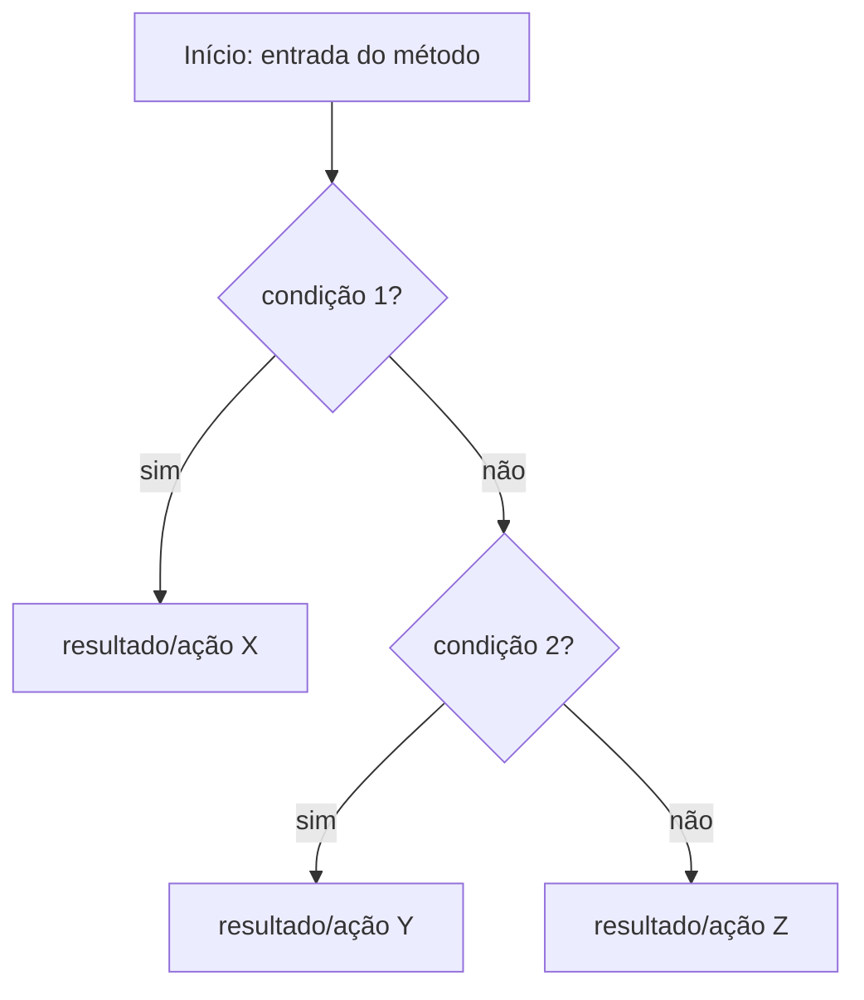
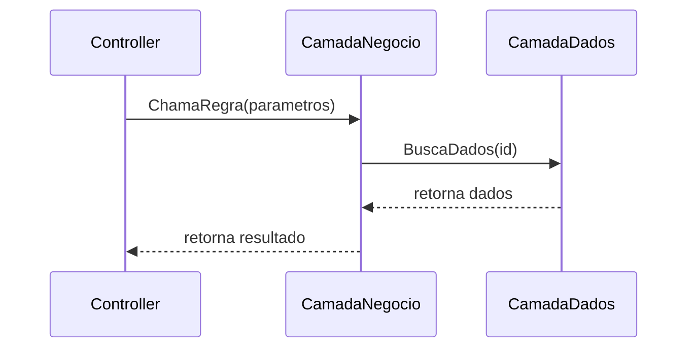
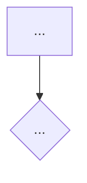
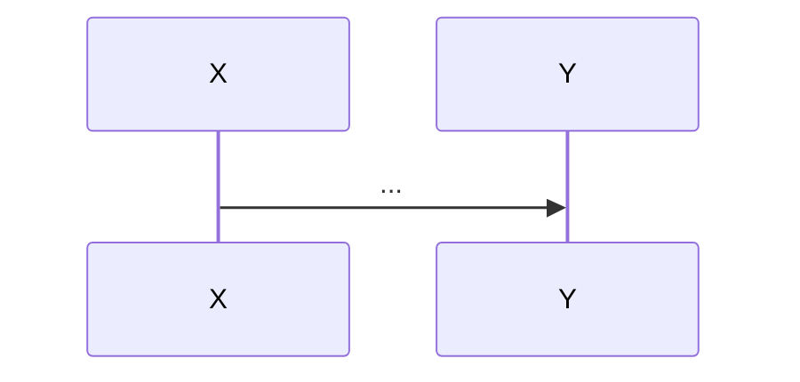

# Aprofundamento pontual (módulo OPCIONAL — só usar quando pedido explicitamente)

Diferente do resto da skill (que é deliberadamente macro/seletivo pra controlar custo), este módulo lê **de verdade**, função por função: corpo completo, condicionais, ramificações. É caro — por isso só entra sob pedido explícito, nunca como parte da análise padrão.

## Quando usar

Só quando o usuário pedir para **aprofundar/explicar/detalhar** uma regra, classe ou método específico — ex: "aprofunda a regra de cálculo de desconto no projeto Negócio", "explica em detalhe o método CalcularFrete".

## Antes de começar: o pedido tem escopo definido?

- **Escopo claro** (uma classe, um método, uma regra nomeada) → prossiga.
- **Escopo vago ou grande demais** (ex: "aprofunda o projeto Negócio inteiro") → **não tente ler tudo.** Responda listando as classes/métodos candidatos (já conhecidos da análise macro) e peça pro usuário escolher por onde começar. Ler um projeto de regra de negócio inteiro função por função é caro o suficiente pra merecer ser feito em pedaços, um de cada vez.

## Processo

1. Localize o(s) arquivo(s) exatos do escopo pedido (pela análise macro já salva, se existir — não re-escaneie a solution inteira pra achar um arquivo).
2. **Identifique a classe/módulo "dona" do método pedido** — é essa classe/módulo que define o nome do arquivo de deep-dive (ver "Onde salvar" abaixo), não o método individual.
3. **Verifique se já existe um arquivo de deep-dive para essa classe/módulo** em `.github/copilot-knowledge/deep-dives/`. Se existir:
   - **O método pedido já tem uma seção nesse arquivo?** → leia a seção existente primeiro. O objetivo é **enriquecer**, não reescrever do zero: identifique o que já foi documentado e o que ainda ficou genérico ou faltando, e atualize só isso.
   - **O método pedido é novo (a classe já tem arquivo, mas não essa seção)?** → **adicione uma nova seção ao arquivo existente**, não crie um arquivo novo. Isso é o ponto principal: dois métodos da mesma classe/core sempre vivem no mesmo arquivo.
   - **Não existe arquivo pra essa classe ainda?** → crie o arquivo com o cabeçalho de classe (ver formato abaixo) e a primeira seção de método.
4. Leia o corpo completo do(s) método(s) em escopo — aqui sim, sem os limites de tamanho das outras fases.
5. Trace a lógica na ordem de execução: condicionais, ramificações, loops, chamadas a outros métodos **dentro do mesmo escopo**. Não persiga chamadas para fora do escopo pedido — se `CalcularDesconto` chama `ValidarCliente` de outra classe não pedida, registre a chamada mas não abra `ValidarCliente` também, a menos que isso também tenha sido pedido (se `ValidarCliente` for da mesma classe/arquivo, é natural que vire a próxima seção quando pedida).
6. Separe sempre **fato** (o que o código literalmente faz) de **interpretação de negócio** (o que isso parece significar) — a segunda categoria leva selo de confiança, seguindo `confidence-criteria.md`, e nunca é apresentada como certeza.

**Regra contra redundância entre seções do mesmo arquivo:** se dois métodos da mesma classe compartilham contexto (ex: ambos usam a mesma validação de entrada, ou o mesmo campo de configuração), descreva esse contexto compartilhado **uma vez**, na seção "Visão geral da classe" no topo do arquivo, e referencie a partir de cada seção de método — não repita o mesmo parágrafo em cada seção.

**Regra contra superficialidade:** cada frase do "Fluxo passo a passo" deve corresponder a uma condição, ramificação ou chamada real e específica do código — nunca uma frase genérica de preenchimento (ex: "o método então processa os dados" não diz nada; "se `cliente.TipoConta == Premium`, aplica desconto de `X%`; senão, verifica se `pedido.Valor > limite` definido em..." diz algo real). Se ao reler o próprio rascunho uma frase poderia se aplicar a qualquer método do sistema, ela é genérica demais — reescreva com o detalhe específico do código ou remova.

## Quando usar fluxograma (Mermaid) — recomendado sempre que houver ramificação real

Se o método/regra tiver **mais de 1-2 pontos de decisão** (`if`/`else`, `switch`, early returns condicionais), inclua um fluxograma Mermaid além do texto — não em vez dele. O motivo prático: um fluxograma **obriga** a listar todo ramo explicitamente (cada aresta precisa ir a algum lugar), o que reduz a chance de pular uma condição por preguiça de descrever em prosa.



Use nomes reais do código nos nós (nome da condição, nome do resultado) — não genéricos como "condição 1". Se o fluxo tiver mais de ~10 nós, é sinal de que o escopo pedido era grande demais para um único aprofundamento — considere sugerir dividir em dois pedidos (ex: a validação de entrada separada do cálculo em si).

## Quando usar diagrama de sequência (Mermaid) — só quando o escopo atravessa múltiplas classes/projetos

Diferente do fluxograma (lógica interna de um método), o diagrama de sequência serve pra mostrar **quem chama quem, em ordem, entre objetos diferentes** — útil quando o aprofundamento pedido envolve um fluxo que atravessa camadas (ex: Controller → Negócio → Dados) ou projetos (ex: chamada de WS mapeada em `discovery-process.md` Fase 2.5). Não use para explicar a lógica interna de um único método — aí o fluxograma é a ferramenta certa.



## Formato de saída

Um arquivo por classe/módulo, com uma seção `##` por método aprofundado — **não um arquivo por método**.

```markdown
---
schema_version: 1
artifact_type: DEEP_DIVE
id: DEEP-DIVE-{project-slug}-{class-slug}
status: CURRENT
owner_skill: analyze-legacy-solution
created_at: {ISO-8601}
updated_at: {ISO-8601}
project: {NomeDoProjeto}
subject: {NomeDaClasse}
---

# Aprofundamento: {NomeDaClasse} ({Projeto})

> Gerado por: skill analyze-legacy-solution — módulo deep-dive
> Projeto: {Nome} (ver projects/PROJECT-{project-slug}.md)
> Última atualização: {DATA_ISO}

## Visão geral da classe
(1 parágrafo: responsabilidade geral da classe, e qualquer contexto compartilhado entre os métodos abaixo — configuração comum, validação de entrada usada por vários métodos, etc. Descrever aqui uma vez só, não repetir em cada seção de método.)

## Métodos aprofundados nesta classe
- [{Método A}](#método-a) — aprofundado em {DATA_ISO}
- [{Método B}](#método-b) — aprofundado em {DATA_ISO}
<!-- atualizar esta lista sempre que uma seção nova for adicionada -->

---

## {Método A}

> Escopo analisado: {arquivo e assinatura exata do método}

### O que faz (resumo em 1 parágrafo)

### Fluxo passo a passo
(texto, na ordem de execução — use indentação pra ramificações, não liste tudo linear)
1. (primeira coisa que o código faz)
2. Se {condição real do código}:
   - (o que acontece nesse ramo)
   Senão:
   - (o que acontece no outro ramo)
3. (...)

### Fluxograma (incluir se houver mais de 1-2 pontos de decisão)



### Diagrama de sequência (incluir só se este método atravessa múltiplas classes/camadas/projetos)



### Regras/condições encontradas (fato — direto do código)
- Condição X → resultado Y

### Interpretação de negócio (confiança: Alta/Média/Baixa)
(O que isso parece significar em termos de regra de negócio real. Nunca apresentar como certeza; sempre com selo.)

### Dependências chamadas a partir daqui (não abertas, só listadas — a menos que sejam da mesma classe e já tenham seção própria)
- (método/classe externo, chamado mas não detalhado)

### Casos de borda / validações
- (o que o código trata explicitamente — nulls, exceptions, limites)

### Limitações desta análise
- Leitura estática apenas — não foi executado.
- Escopo limitado a este método — chamadas para fora não foram aprofundadas (a menos que listadas acima como já cobertas).

### Perguntas em aberto
- (o que só o time consegue confirmar)

---

## {Método B}
(mesma estrutura acima, como nova seção — não como novo arquivo)
```

## Onde salvar

`.github/copilot-knowledge/deep-dives/DEEP-DIVE-{project-slug}-{class-slug}.md` — **um arquivo por classe/módulo**, nunca por método.

Se não houver classe clara, use `DEEP-DIVE-{project-slug}-{file-slug}.md`.

Referencie o arquivo (não a seção específica) em:
- Na seção "Core funcional" do `projects/PROJECT-{project-slug}.md` correspondente.
- No `PROJECT-{project-slug}.md` correspondente. Em seguida, reconstrua o `INDEX.md` com `.github/skill-contracts/scripts/sync_index.py`; nunca o edite manualmente.

## Limite explícito

Não encadeie aprofundamentos automaticamente ("já que abri esse, vou abrir os que ele chama também"). Cada aprofundamento é do tamanho exato do que foi pedido. Se o usuário quiser mais, ele pede o próximo — e se o próximo for da mesma classe já aprofundada antes, ele vira uma seção nova no arquivo existente, não um arquivo novo (essa é a regra mais importante deste documento — releia o passo 3 do Processo se tiver dúvida).
